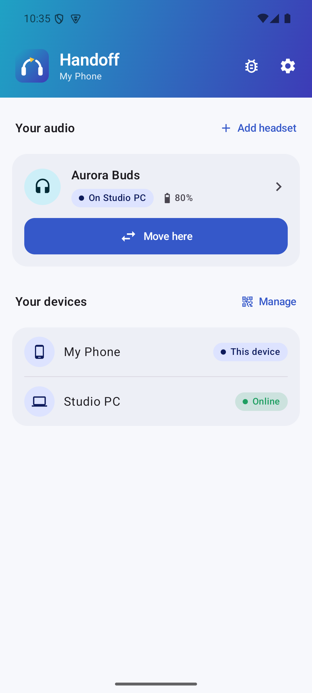
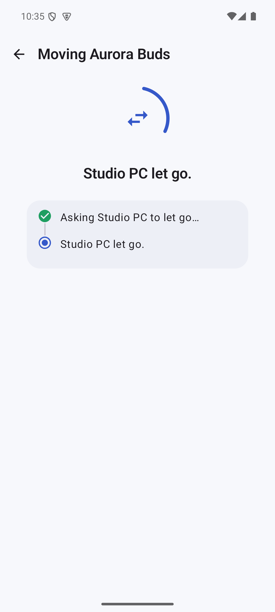
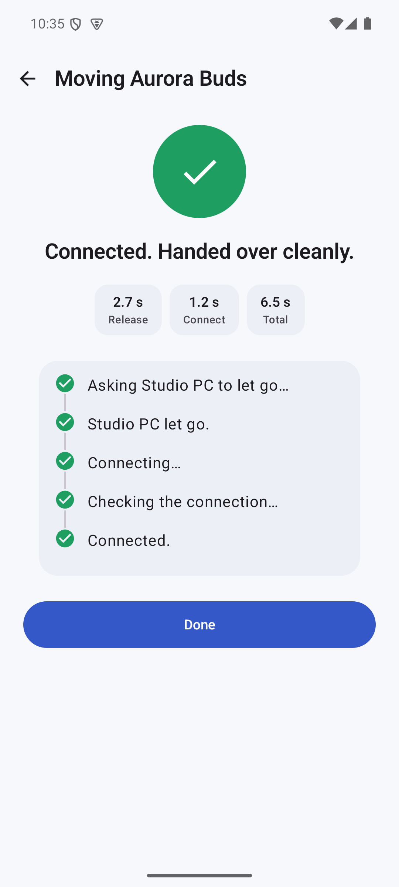
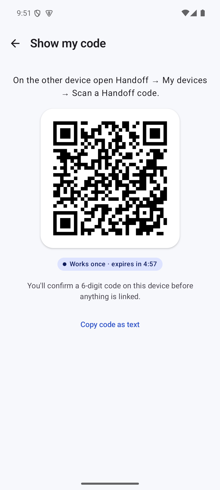
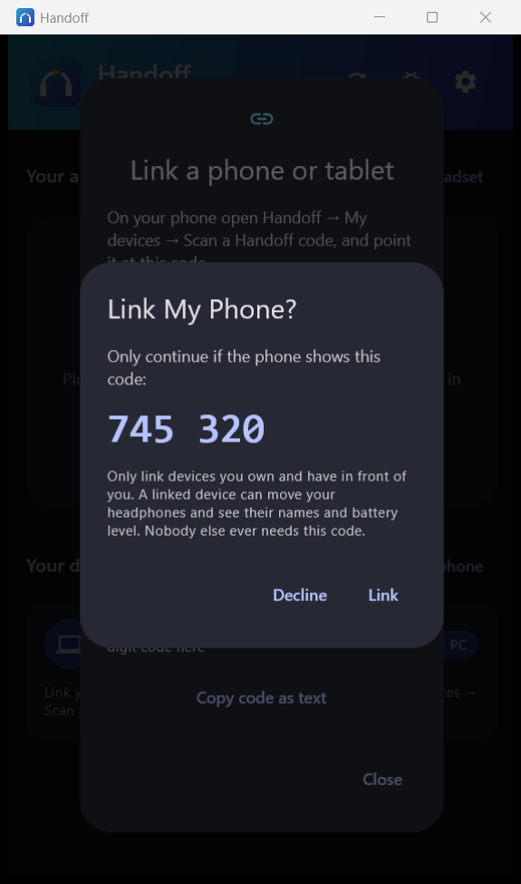
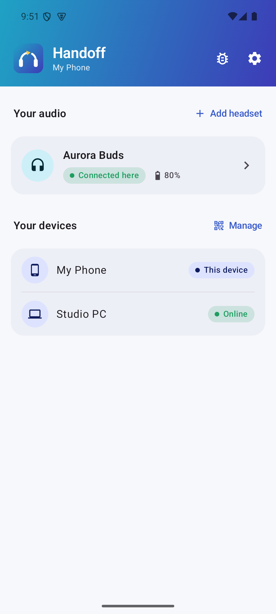
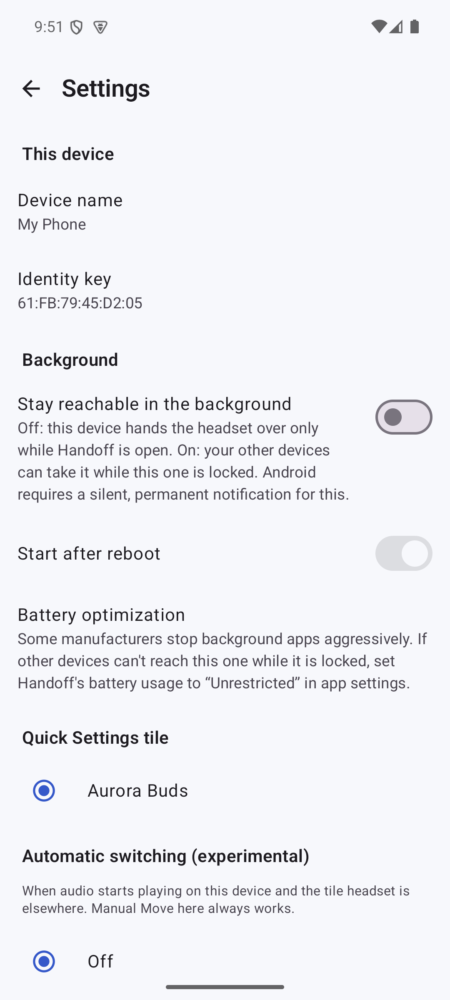
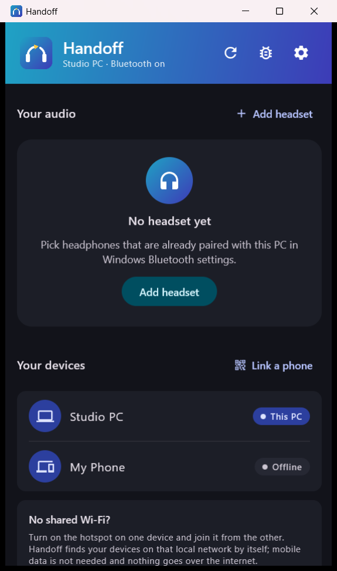

<p align="center"></p>

<h1 align="center">Handoff</h1>

<p align="center"><b>Your Bluetooth headphones, on whichever device you pick up.</b><br>
One tap moves an already-paired headset between Android phones, tablets and Windows PCs.</p>

<p align="center">
  
  
  
  
</p>

<table align="center">
  <tr>
    <td align="center"></td>
    <td align="center"></td>
    <td align="center"></td>
  </tr>
  <tr>
    <td align="center"><sub>The headphones are on the PC</sub></td>
    <td align="center"><sub><b>Move here</b>: the PC lets go</sub></td>
    <td align="center"><sub>Connected and verified on the phone</sub></td>
  </tr>
</table>

---

**Move here** is the whole interaction. The device holding the headphones lets go of them, the device in your hand connects, and Handoff confirms that audio is really connected. There's no Bluetooth menu, no re-pairing, and no need to unlock the other device.

## Highlights

- **Coordinated handover.** The current device releases media *and* call audio before the new one connects, so single-point headsets switch cleanly. If the other device can't be reached, Handoff connects directly instead.
- **Verified, not assumed.** Every move ends with a check that the headset really connected, with one automatic retry and a plain-language explanation if something stands in the way.
- **Phones, tablets and PCs.** Android phones and tablets link with each other and with Windows PCs, and every device shows where the headset is and its battery level.
- **Link once, use anywhere.** Links belong to your devices, not to a Wi-Fi network. They keep working at home, at work and on the road, and devices find each other again automatically.
- **Works without Wi-Fi.** One device's hotspot is enough. Nothing goes over the internet and no mobile data is needed.
- **Private by design.** No account, no cloud, no telemetry. Linked devices talk end-to-end encrypted on your local network only.
- **Always at hand.** A Quick Settings tile and optional automatic switching when audio starts playing on Android; a tray menu on Windows.

## How it works

<table align="center">
  <tr>
    <td align="center"></td>
    <td align="center"></td>
    <td align="center"></td>
  </tr>
  <tr>
    <td align="center"><sub>A single-use link code</sub></td>
    <td align="center"><sub>Approve when the numbers match</sub></td>
    <td align="center"><sub>Every device knows where the headset is</sub></td>
  </tr>
</table>

1. **Pair** the headphones with each device as usual, in its Bluetooth settings.
2. **Link** your devices once. One device shows a single-use code, the other scans it, and both screens show the same 6-digit number to approve.
3. **Add** the headset on each device. Handoff recognises it as the same headset everywhere.
4. **Move here.** Your device finds which linked device holds the headset and asks it to let go. That device releases media and calls and confirms, then your device connects and verifies.

Audio always flows directly between a device and the headphones. Handoff decides *which* device is connected, and never streams or relays sound.

## Security and privacy

| | |
|---|---|
| **Linking** | Single-use codes that expire in 5 minutes, plus an on-screen 6-digit comparison. Unlinked devices are refused before they can send anything. |
| **Encryption** | Every connection is authenticated with the linked device's key and encrypted end to end (P-256, AES-256-GCM). Commands are fresh, single-use and bound to their session. |
| **Network** | Only local-network addresses are served, so Handoff can't be reached from the internet. Addresses that keep failing are rate-limited and blocked. |
| **Discovery** | Devices announce themselves under a name that changes daily and that only linked devices can recognise. Device names and headset details go to linked devices only. |
| **Data** | No account, cloud, analytics or ads. Diagnostics stay on the device, and exports remove Bluetooth addresses and keys. |
| **Updates** | Checked only on request or once a day if enabled. An update is installed only if it carries Handoff's release signature and matches its published checksum. |

The full design is in [docs/SECURITY.md](docs/SECURITY.md).

## Designed to stay out of the way

On Android, Handoff runs while it's open and shows no permanent notification. **Stay reachable in the background** is an opt-in setting that lets a locked device hand over the headset too. On Windows, Handoff lives in the tray and starts with Windows.

When no linked device is on the same network, Handoff suggests the simplest fix: a hotspot from one device, which works without Wi-Fi or mobile data.

<table align="center">
  <tr>
    <td align="center"></td>
    <td align="center"></td>
  </tr>
  <tr>
    <td align="center"><sub>Background mode is opt-in</sub></td>
    <td align="center"><sub>No shared Wi-Fi? A hotspot is enough</sub></td>
  </tr>
</table>

## Documentation

| | |
|---|---|
| [Getting started](docs/GETTING_STARTED.md) | Install, link and set up; networks and hotspots; permissions; messages |
| [Security](docs/SECURITY.md) | Threat model, linking, handshake, network exposure |
| [Architecture](docs/ARCHITECTURE.md) | Modules, ownership model, protocol and state machine |
| [Bluetooth compatibility](docs/BLUETOOTH_COMPATIBILITY.md) | How Android and Windows are driven, compatibility levels |
| [Hardware test plan](docs/HARDWARE_TEST_PLAN.md) | Scenarios for validating a phone, PC and headset combination |
| [Contributing](CONTRIBUTING.md) | Building, tests, demo mode and hardware tests |

## Download

Get the latest version from **[Releases](https://github.com/FancyCorey/handoff/releases/latest)**: the APK for Android, an installer or portable zip for Windows. After that, Handoff can update itself: every update is checked against Handoff's release signature before it is installed. See [Getting started](docs/GETTING_STARTED.md#install) for details.

## Building

```bash
./gradlew test assembleDebug                          # Android APK and all tests
./gradlew :desktop:packageExe :desktop:packageMsi     # Windows installers
```

JDK 17 or newer and an Android SDK with platform 36 are required. See [CONTRIBUTING.md](CONTRIBUTING.md) for details.

*Screenshots are taken in Handoff's demo mode; "My Phone", "Studio PC" and "Aurora Buds" are fictional devices.*

## License and acknowledgements

Handoff is released under the [MIT License](LICENSE).

Handoff's approach to connecting and releasing Bluetooth audio on Android and Windows was adapted from **[PodSwitch](https://github.com/Felip6499/PodSwitch)** by Felip6499 (MIT License). Its notice, the list of every bundled open-source component and their full license texts are in [THIRD_PARTY_NOTICES.md](THIRD_PARTY_NOTICES.md) and under **Settings → Open-source licenses** in both apps.
