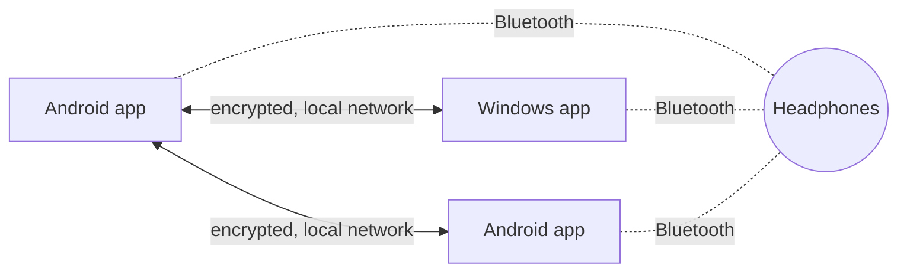

<p align="center"></p>

<h1 align="center">Handoff</h1>

<p align="center"><b>Your Bluetooth headphones, on whichever device you pick up.</b><br>
One tap moves your headphones between your Android phone, tablet and Windows PC.</p>

<p align="center">
  <a href="https://github.com/FancyCorey/handoff/releases/latest"><b>Download the latest version</b></a>
  &nbsp;·&nbsp;
  <a href="docs/GETTING_STARTED.md">Getting started</a>
  &nbsp;·&nbsp;
  <a href="#compatibility">Compatibility</a>
  &nbsp;·&nbsp;
  <a href="#qa">Q&amp;A</a>
</p>

<p align="center">
  
  
  
  
</p>

<table align="center">
  <tr>
    <td align="center"></td>
    <td align="center"></td>
    <td align="center"></td>
  </tr>
  <tr>
    <td align="center"><sub>Your headphones are on the PC</sub></td>
    <td align="center"><sub>Tap <b>Move here</b> on your phone</sub></td>
    <td align="center"><sub>A few seconds later, they're on your phone</sub></td>
  </tr>
</table>

---

You're listening on your laptop, then pick up your phone to watch a video, and the sound stays on the laptop. Normally you'd open Bluetooth settings on the laptop, disconnect, then do the same on your phone. **With Handoff you tap Move here on the phone, and that's it.** The laptop lets go of the headphones and your phone connects to them. You don't even need to touch the laptop.

## What you can do

- **Move your headphones with one tap**, from a phone, a tablet or a PC, in any direction.
- **See where your headphones are** from any of your devices, along with their battery level.
- **Use it anywhere.** Link your devices once and they find each other on any Wi-Fi: at home, at work or on the road. No Wi-Fi? A hotspot from your phone or PC is enough.
- **Know what's happening.** Handoff checks that sound really comes through, tries once more if something gets in the way, and shows what went wrong and what to do if it can't finish.
- **Stay in control.** Cancel a move at any time, and choose whether Handoff should run in the background.
- **Reach it quickly** from a Quick Settings tile on Android or the tray icon on Windows.

## Get started

1. **Download** Handoff for each of your devices from the [latest release](https://github.com/FancyCorey/handoff/releases/latest):

   | Your device | File |
   |---|---|
   | Android phone or tablet | `Handoff-<version>.apk` |
   | Windows PC | `Handoff-<version>-setup.exe` |

2. **Pair your headphones** with each device as you normally would, in its Bluetooth settings.
3. **Link your devices.** One shows a code, the other scans it, and you confirm that both show the same number.
4. **Add your headphones** in Handoff on each device.

Then press **Move here** whenever you want to switch. The [getting started guide](docs/GETTING_STARTED.md) walks through every step.

<table align="center">
  <tr>
    <td align="center"></td>
    <td align="center"></td>
    <td align="center"></td>
  </tr>
  <tr>
    <td align="center"><sub>Show a code on one device…</sub></td>
    <td align="center"><sub>…and confirm on the other</sub></td>
    <td align="center"><sub>Every device knows where your headphones are</sub></td>
  </tr>
</table>

## Compatibility

| | Works with |
|---|---|
| **Android** | Android 12 or newer, on phones and tablets |
| **Windows** | Windows 10 or 11 (64-bit), on laptops and desktops with Bluetooth |
| **Headphones** | Bluetooth headphones, earbuds and headsets, including ones that connect to two devices at once |

Not available yet: Android 11 or older, Windows on ARM, macOS, Linux, iPhone and iPad. The full [compatibility list](docs/BLUETOOTH_COMPATIBILITY.md#compatibility) covers speakers, car audio and LE Audio headphones.

## Private and secure

- **No account, no cloud, no tracking.** Handoff doesn't collect anything. Your devices only talk to each other, on your own network.
- **Only your devices.** A device can only join after you approve it on screen, with a code that works once and expires after five minutes.
- **Encrypted.** Everything your devices say to each other is encrypted, and Handoff can't be reached from the internet.
- **Safe updates.** Handoff only installs updates that are signed by this project, so a tampered download is rejected.

The technical details are in the [security overview](docs/SECURITY.md).

<table align="center">
  <tr>
    <td align="center"></td>
    <td align="center"></td>
  </tr>
  <tr>
    <td align="center"><sub>Running in the background is your choice</sub></td>
    <td align="center"><sub>No shared Wi-Fi? Handoff suggests a hotspot</sub></td>
  </tr>
</table>

## Q&A

**Which headphones work?**
Any Bluetooth headphones, earbuds or headset that you can pair with your devices. Handoff works best with headphones that connect to one device at a time. For headphones that can already connect to two devices at once, Handoff moves the sound without disconnecting the other device.

**Does my audio go through Handoff?**
No. Sound always goes straight from your phone or PC to your headphones. Handoff only decides *which* device is connected.

**Do I need an account or an internet connection?**
No. Your devices just need to be on the same Wi-Fi, or on a hotspot from one of them. The internet is only used if you ask Handoff to check for updates.

**Will it work on my Android phone?**
If it runs Android 12 or newer, most likely. Android doesn't offer apps an official way to connect headphones, so Handoff uses features that some phone makers can restrict. The first time you open Handoff, it tells you whether your phone supports it. See [Compatibility](#compatibility).

**Does it need to stay open?**
On Windows, Handoff runs in the tray. On Android, it works while the app is open. Turn on **Stay reachable in the background** if you also want other devices to take the headphones while your phone is locked.

**Why does Windows warn me about the download?**
Handoff is new and not yet code-signed, so Windows may say "Windows protected your PC". Choose **More info → Run anyway**. On PCs with *Smart App Control* switched on, Windows doesn't offer this option yet.

**Is it free?**
Yes. Handoff is free and open source under the [MIT License](LICENSE).

**Something's not working.**
The [troubleshooting section](docs/GETTING_STARTED.md#if-something-goes-wrong) covers the common cases. You can also [open an issue](https://github.com/FancyCorey/handoff/issues).

## For developers

Handoff is written in Kotlin: an Android app, a Windows app built with Compose Multiplatform, and a shared core that handles linking, encryption and moving the headphones. There is no server: each device runs Handoff, and the copies talk to each other directly on the local network.



The [architecture notes](docs/ARCHITECTURE.md) show how a move works step by step, the transfer states, device discovery and updates, with diagrams.

```bash
./gradlew test assembleDebug                          # tests and the Android app
./gradlew :desktop:packageExe :desktop:packageMsi     # Windows installers
```

You'll need JDK 17 or newer and an Android SDK with platform 36.

| | |
|---|---|
| [Contributing](CONTRIBUTING.md) | Building, tests, demo mode and releases |
| [Architecture](docs/ARCHITECTURE.md) | How the apps are put together |
| [Security](docs/SECURITY.md) | Threat model, linking and encryption |
| [Bluetooth compatibility](docs/BLUETOOTH_COMPATIBILITY.md) | How Handoff controls Bluetooth on Android and Windows |
| [Hardware test plan](docs/HARDWARE_TEST_PLAN.md) | Checking a phone, PC and headset combination |

*The screenshots use Handoff's demo mode, so "My Phone", "Studio PC" and "Aurora Buds" are example devices.*

## License and credits

Handoff is free and open source under the [MIT License](LICENSE).

Its approach to connecting and disconnecting Bluetooth headphones was adapted from **[PodSwitch](https://github.com/Felip6499/PodSwitch)** by Felip6499 (MIT License). Credits and the licenses of every open-source component Handoff uses are in [THIRD_PARTY_NOTICES.md](THIRD_PARTY_NOTICES.md), and in the apps under **Settings → Open-source licenses**.
