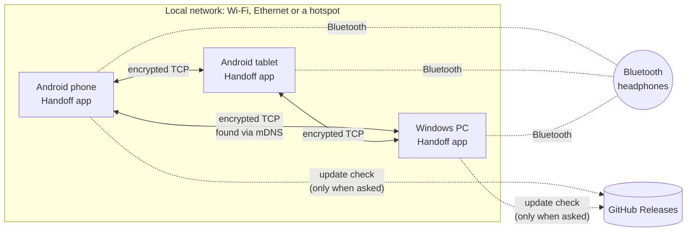
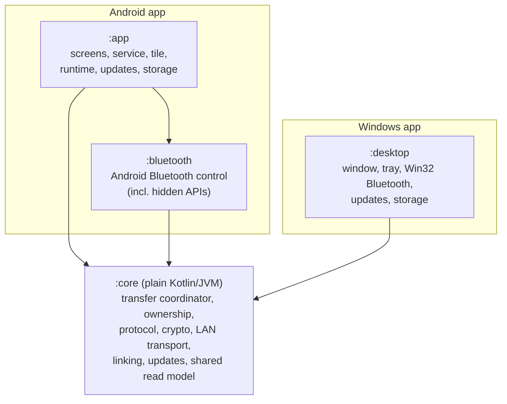
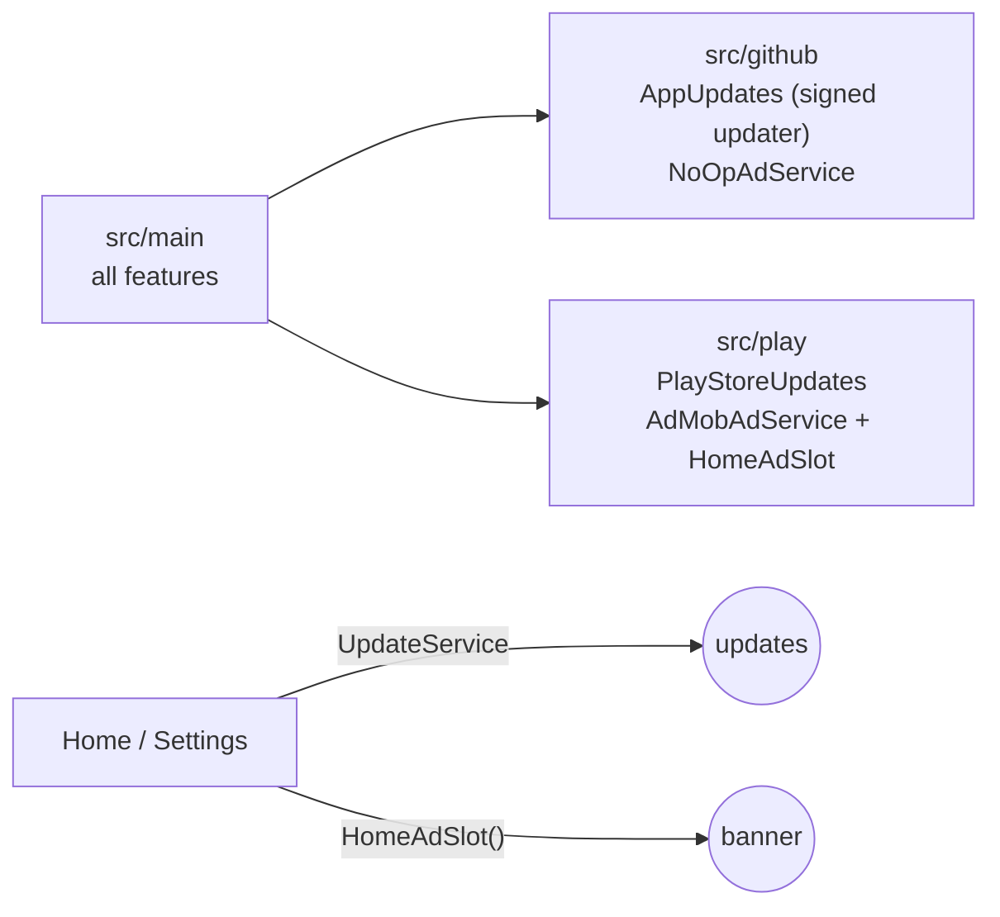
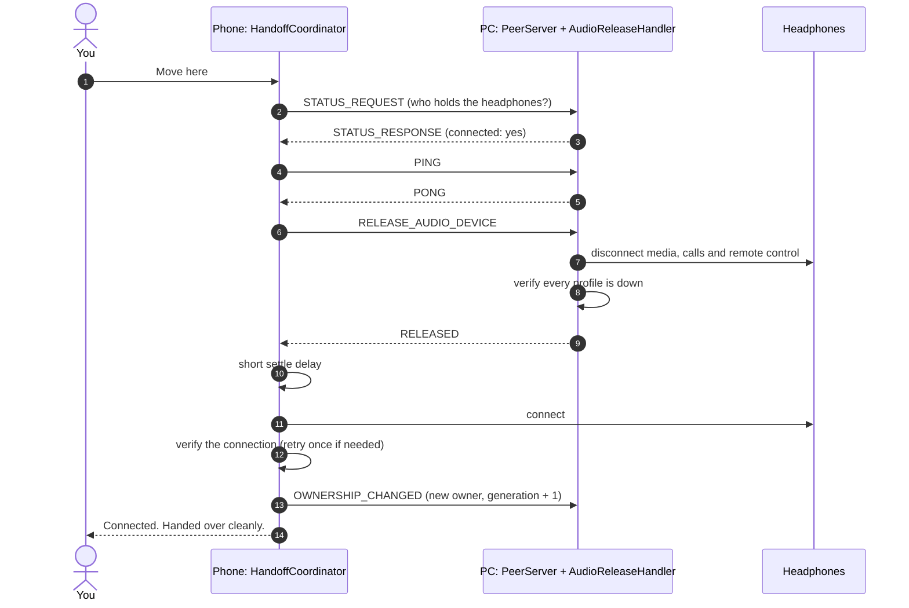
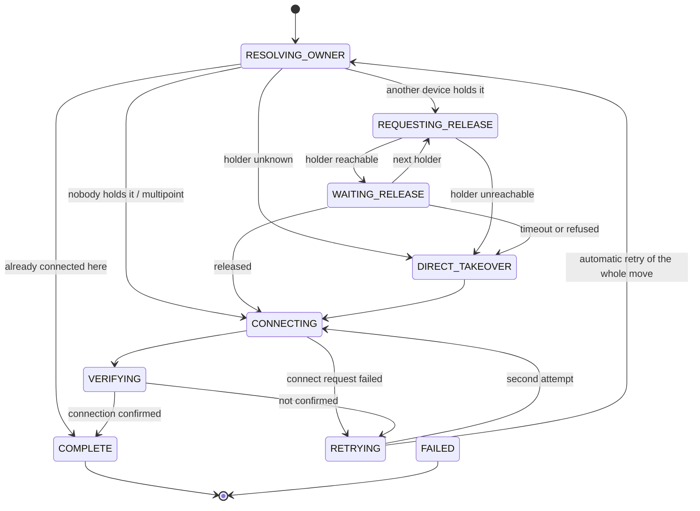
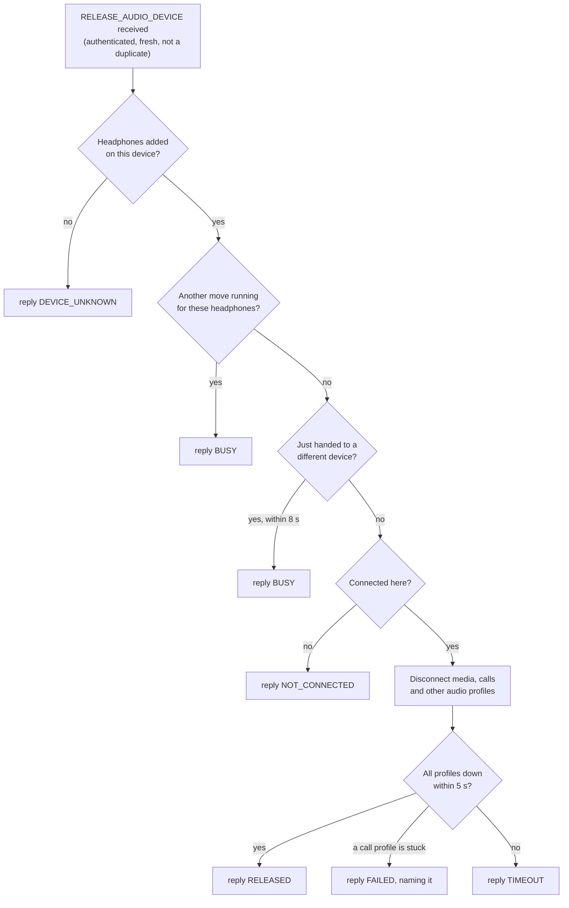
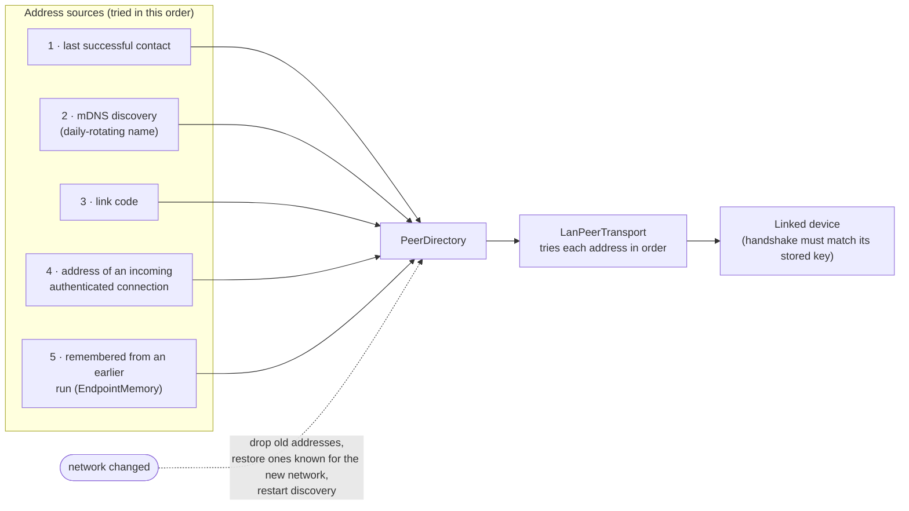
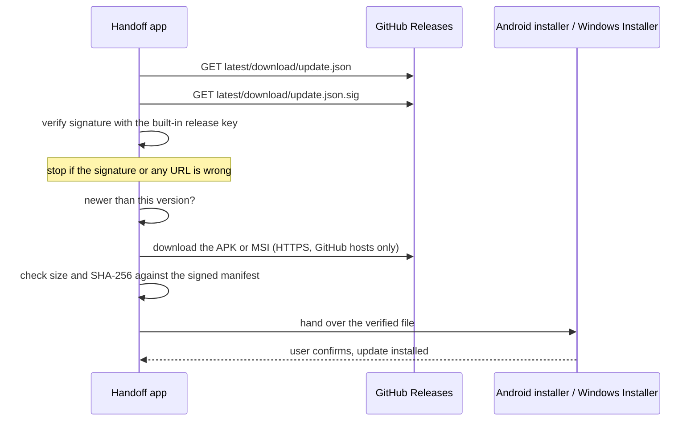

# Architecture

## System overview

Each device runs its own copy of Handoff. The copies talk to each other directly over the local network; there is no server. Audio never passes through Handoff: each device talks to the headphones over Bluetooth as usual, and Handoff only decides which device is connected.



At any moment, one device holds the headphones (or several, for headphones that connect to two devices at once). **Move here** asks the holder to let go, then connects the device in your hand.

## Modules and layers



Components of each module:

```
┌──────────────────────────────── :app (Android) ─────────────────────────────────┐
│ UI (Compose, Material 3): Setup · Home · Headset details · Add headset ·         │
│    My devices · Show / scan code · Transfer · Settings (incl. updates) ·         │
│    Diagnostics · Bluetooth test                                                  │
│ Android services: HandoffService (FGS connectedDevice) · BootReceiver ·          │
│    NotificationActionReceiver · MoveHereTileService · PlaybackWatcher            │
│ Runtime: HandoffRuntime (lifecycle) · HandoffActions (single "move" entry,       │
│    cancel) · AppUpdates (check, verified download, system installer)             │
│ Mesh (Android): NsdPeerDiscovery · NetworkAddresses · NetworkMonitor             │
│ Persistence: Room (peers, headsets, transfer history) · DataStore (settings) ·   │
│    Android Keystore (identity key) · peer-endpoints.json (no-backup dir)         │
├──────────────────────────────── :bluetooth (Android lib) ───────────────────────┤
│ AndroidBluetoothAudioController ─ strategy chain:                                │
│    PublicApiStrategy → ReflectionA2dpStrategy (non-SDK) → FutureOemStrategy      │
│ CompanionProfileReleaser (HFP / LE Audio release, non-SDK)                       │
│ ProfileProxyProvider · SystemBluetoothEvents · DeviceClassifier ·                │
│    HiddenMethodInvoker                                                           │
├──────────────────────────────── :desktop (Windows, Compose Desktop) ────────────┤
│ DesktopApp (composition root) · UI (HomeScreen, dialogs) · tray · Autostart ·    │
│    SingleInstance · DesktopUpdates (verified MSI → Windows Installer)            │
│ WindowsBluetoothAudioController ─ Win32 BluetoothSetServiceState via JNA          │
│ DesktopIdentityProvider (DPAPI) · JSON stores · JmdnsDiscovery                   │
├──────────────────────────────── :core (pure Kotlin/JVM) ────────────────────────┤
│ handoff:   HandoffCoordinator (move, cancel) · TransferStateMachine ·            │
│            HandoffPolicy · AudioReleaseHandler · HandoffRequestHandler ·         │
│            OwnershipBroadcaster · AutoSwitchPolicy · MeshSync                    │
│ ownership: OwnershipResolver · OwnershipRepository · MeshOwnershipRepository ·   │
│            MappingReconciler                                                     │
│ bluetooth: BluetoothAudioController (port) · DemoBluetoothAudioController ·      │
│            diagnostics model · throttle                                          │
│ mesh:      protocol (PeerMessage, codec) · security (handshake, channel, guard,  │
│            invitation) · transport (PeerTransport, LanPeerTransport, PeerServer, │
│            ConnectionPolicy, PeerDirectory, EndpointMemory, DiscoveryTags) ·     │
│            pairing (PairingManager, PairingClient)                               │
│ update:    UpdateChecker (signed manifest, verified download) · UpdateKeys ·     │
│            ReleaseTool (maintainer signing)                                      │
│ overview:  OverviewRepository (dashboard read model, shared by both apps)        │
│ text:      HandoffTexts (shared wording) · OpenSourceNotices                     │
└──────────────────────────────────────────────────────────────────────────────────┘
```

Dependency direction: `app → bluetooth → core`, `app → core`, `desktop → core`. The Windows app runs the *same* coordinator, protocol, crypto, pairing and sync code as Android; only Bluetooth, storage and discovery are platform-specific. `:core` has no Android dependency, so the whole transfer algorithm, protocol and crypto are tested on the plain JVM, including over real TCP sockets.

### Android editions

The Android app is built in two flavors (`distribution` dimension) from the same `src/main`:



* Shared code sees only two small seams: `UpdateService` (a newer version to show, and a hook at start-up) and `AdService` (whether a banner may show), plus the composables `UpdateSettings`, `HomeAdSlot` and `AdPrivacySettings`, which each flavor provides. Each flavor's `editionModule` binds them in Koin.
* Nothing flows *into* the ad code: it receives no headsets, peers, addresses or events, and neither the coordinator, the Bluetooth layer, the mesh, ownership nor any service depends on it. The GitHub edition's `HomeAdSlot` draws nothing.
* `:app:verifyEditions` checks the merged manifests and dependency graph: no install permission or update provider in Play, no ad library or advertising ID in GitHub. Details in [PLAY_STORE.md](PLAY_STORE.md).

**Isolation of hidden APIs.** Only `ReflectionA2dpStrategy` + `HiddenMethodInvoker` perform reflection, and both are `internal` to `:bluetooth`. The domain sees `BluetoothAudioController`, which returns structured results (`Requested`, `AlreadyInState`, `Failed(BluetoothError, strategy, detail)`), and never exceptions.

## Identity, trust and peers

* **Identity:** a random UUID `PeerId`, a display name, and a P-256 signing key generated in the Android Keystore (non-exportable).
* **Trust:** `TrustedPeer(peerId, name, publicKey)` rows in Room. Only these peers can open a session (see [SECURITY.md](SECURITY.md)).
* **Discovery:** NSD advertises `_handoff._tcp` / `handoff-<daily tag>` (`DiscoveryTags`; see SECURITY.md). `PeerDirectory` merges endpoints from five sources, tried in this order:
  1. the last successful contact
  2. mDNS
  3. the link code
  4. the source address of authenticated inbound sessions
  5. an address remembered from an earlier run on another network (`EndpointMemory`)

  Online status comes from mDNS plus recent authenticated contact.
* **Transport:** one short-lived TCP connection per request. Each one does a handshake, one encrypted request and one encrypted reply. `PeerTransport` is an interface, so a relay can implement it later.

## Logical devices

The same headset is a different `BluetoothDevice` on every host. A `LogicalAudioDevice` has these fields:

* `logicalId`: shared by all hosts
* `displayName`, `deviceType`
* `fingerprint`: SHA-256 of `"handoff-audio-device-v1|" + address`, truncated
* `localDeviceId`: this host's bonded address, never sent to peers
* `multipoint`
* `lastKnownOwner`, `ownershipGeneration`
* `hostMappings`: the hosts known to map it

On mapping, peers' announced headsets with an equal fingerprint are pre-selected. Names are never used for matching. If two hosts mapped the same headset independently, `MappingReconciler` makes both adopt the lexicographically smaller logical id.

## Ownership

Each host is authoritative for its own A2DP state and reports it in `STATUS_RESPONSE` and `OWNERSHIP_CHANGED`. `OwnershipResolver` combines local state with fresh reports (≤ 2 min old, peer online):

| Holders | Result |
|---|---|
| this host only | `LOCAL` |
| one peer | `PEER(id)` |
| several, headset declared multipoint | `MULTIPOINT` |
| several, single-point | `CONFLICT` (a report is stale or racing) |
| none, and every mapped host reported | `NONE` |
| none, but a mapped host is silent / local state unreadable | `UNKNOWN(lastKnownOwner)` |

`ownershipGeneration` increases on every successful transfer. The highest generation wins when hosts disagree.

## Transfer algorithm

A move, end to end, when the headphones are on the PC and you tap **Move here** on the phone:



If the PC can't be reached, refuses, or doesn't answer in time, the phone connects directly instead (*direct takeover*). Most headphones that connect to one device at a time then drop the old device by themselves.

### Transfer states

Every transfer runs through an explicit state machine (`TransferStateMachine`). Any active state can also end in `FAILED`, including when the user cancels.



The same algorithm as pseudocode, with its timeouts:

`DefaultHandoffCoordinator.moveToThisDevice` is the only switching path:

```kotlin
mutex(logicalId).tryLock() ?: return InProgress          // repeated presses
RESOLVING_OWNER
  no local mapping          -> MissingLocalMapping
  Bluetooth off / no perm   -> Failed(BLUETOOTH_OFF / PERMISSION_DENIED)
  already connected         -> COMPLETE (AlreadyConnected)
  refresh peer status (≤1.5 s), resolve ownership
PEER / CONFLICT (/ MULTIPOINT if exclusive):
  REQUESTING_RELEASE: PING (≤1.5 s)   unreachable -> DIRECT_TAKEOVER
  WAITING_RELEASE: RELEASE_AUDIO_DEVICE (≤9 s)
    RELEASED | NOT_CONNECTED -> settle 600 ms -> CONNECTING
    BUSY                     -> FAILED(CONTENTION)   (never steal mid-transfer)
    TIMEOUT / refused / error -> DIRECT_TAKEOVER
UNKNOWN -> DIRECT_TAKEOVER;  NONE -> CONNECTING;  MULTIPOINT -> CONNECTING (join)
CONNECTING -> VERIFYING (A2DP CONNECTED within 8 s) -> COMPLETE
            \-> RETRYING (1.5 s; abort with CONTENTION if another host connected meanwhile)
                -> CONNECTING (attempt 2) -> VERIFYING -> COMPLETE | FAILED
COMPLETE: generation+1, persist owner, OWNERSHIP_CHANGED to peers (background)
```

`UNSUPPORTED`, `PERMISSION_DENIED`, `BLUETOOTH_OFF`, `DEVICE_NOT_BONDED` and `RATE_LIMITED` are never retried.

**Automatic retry and error classification.**

* A peer that doesn't answer is probed once more (after 1.5 s) before the transfer falls back to a direct takeover.
* If both connect attempts of a round fail, the coordinator waits 3 s and runs **one more full round**: owner lookup, release, connect and verify. The progress shows *"That didn't work. Trying once more…"*.
* The retry round is skipped if Bluetooth went off, or if another device took the headset during the pause (that is `CONTENTION`, never a steal-back).
* After the last round, the failure is classified by *why* the transfer fell back:

  | Result | When |
  |---|---|
  | `OWNER_UNREACHABLE` | The holder couldn't be reached (another Wi-Fi, asleep, not running, firewall). The detail is its name. |
  | `OWNER_REFUSED` | The holder answered but couldn't let go. The detail is its reason, e.g. a call profile Android refused to drop. |
  | `HEADSET_NOT_RESPONDING` | Nobody else held the headset, or it was released, but it still didn't connect. |

* `HandoffDiagnosis` turns transport rejections into user-facing messages: clock skew over 5 minutes, a different app version, a no-longer-linked device, a reinstalled device.
* A host holding the headset through *any* profile (A2DP, HFP or LE Audio) reports it as connected, so a call-only link is never mistaken for "free". The legal transitions are declared in `TransferStateMachine.TRANSITIONS`. An illegal one throws, and the coordinator turns that into `Failed(INTERNAL)`.

**Cancelling.** `HandoffCoordinator.cancel(logicalId)` cancels the running attempt, which runs as a child job of `moveToThisDevice`. The transfer ends with `HandoffResult.Cancelled`, a `CANCELLED` step and a history record, and the per-headset lock is released. Anything already done (for example the other host's release) stays done. On Android, `HandoffActions.cancel` also stops a move that is still waiting for discovery before the coordinator has started it.

**Why `BUSY` doesn't lead to a takeover:** a `BUSY` reply does *not* trigger direct takeover. `BUSY` means the owner is mid-transfer or has just released to another peer. Taking over then would make two hosts fight over the headset.

### Remote side (`AudioReleaseHandler`)

The handler runs headless, so it works with the screen off:



1. Look up the local mapping. If there is none, reply `DEVICE_UNKNOWN`.
2. Take the same per-device mutex without waiting. If it's held, reply `BUSY`.
3. If the headset was released to *another* peer within 8 s, reply `BUSY` (anti-ping-pong).
4. If it isn't connected, reply `NOT_CONNECTED`.
5. Disconnect A2DP **and every other audio profile the headset holds (HFP calls, LE Audio)**, then verify that all of them are down within 5 s.
   * If they are, reply `RELEASED`.
   * If only a call profile is stuck, reply `FAILED` with a detail naming it.
   * Otherwise, reply `TIMEOUT`.

   A single-point headset stays attached to a host while *any* profile is connected, so releasing A2DP alone is not enough: the headset would keep refusing the new host.
6. If the disconnect call itself failed, reply `UNSUPPORTED`, `PERMISSION_DENIED` or `FAILED`.

Duplicate command ids get the cached reply (`CommandGuard`), which makes release idempotent.

### Concurrency cases

| Case | Handling |
|---|---|
| Repeated Move here | `tryLock` → `InProgress` |
| Two hosts request simultaneously | Owner serves one (mutex); the other gets `BUSY` → `CONTENTION` |
| Headset off mid-transfer | Verify times out → one retry → `VERIFY_TIMEOUT` |
| Bluetooth disabled | Pre-check; controller returns `BLUETOOTH_OFF`, not retried |
| Peer disappears | Ping/timeout → direct takeover; peer marked offline |
| Old host reconnects / third device steals | `HandoffRuntime` pushes local state changes; the retry path checks for new holders |
| Multipoint | Joins by default; never disconnects others unless `releaseOthersOnMultipoint` |
| Hammering | `OperationThrottle` (12 ops/min) in the controller; `AutoSwitchPolicy` cooldowns |

## Background execution

`HandoffService` is a foreground service of type `connectedDevice`. It holds the runtime (peer server + NSD) while *Stay reachable in the background* is on (off by default; otherwise the runtime runs only while the UI is open). It runs no timers or polling; a process with a foreground service keeps network access while the device is idle.

While the UI is visible, the runtime refreshes peer status every 10 s. In the background, updates are event-driven:

* discovery events
* this host's A2DP changes, pushed to peers
* inbound requests

`BootReceiver` restarts the service only when the user enabled it.

## Automatic switching (optional)

`PlaybackWatcher` registers `AudioManager.registerAudioPlaybackCallback` while the service runs and the mode is not OFF. When media starts, `AutoSwitchPolicy` decides:

* **ASK:** show a notification.
* **AUTO:** call `HandoffActions.moveHere(..., AUTOMATIC)`, the same coordinator.
* **Ignore:** do nothing.

It ignores playback when the headset is already here, on multipoint or conflict, within 30 s of the last trigger, or within 60 s of handing the headset to a peer.

## Networks

How a device finds the address of a linked device:



A link is bound to two identity keys, never to a network, SSID or IP address, so a pair of devices is linked once and works on every network they share.

* **Discovery:** mDNS on each network (Android `NsdManager`, Windows JmDNS).
* **Network changes:**
  * Android's `NetworkMonitor` (a ConnectivityManager callback) and the Windows app (polling its LAN addresses every 3 s) detect a new network.
  * On a change they call `PeerDirectory.onNetworkChanged()`. This drops every address learned on the old network and clears online/failing flags.
  * They then restart mDNS advertisement and discovery on the new network, and refresh peer status.
* **Fallback addresses:** the last successful address and the source address of authenticated inbound sessions. These help on networks where multicast is flaky.
* **Remembered addresses:** `EndpointMemory` keeps each peer's last working address per network (at most 8) in app-private storage. At start-up, and after a network change, `PeerDirectory.restore` puts back the addresses for the networks this host is on now, so devices reach each other immediately, even where mDNS is blocked.
* **Hotspots:** the addresses of this device's own hotspot (tethering interfaces on Android, the Mobile Hotspot adapter on Windows) count as local networks, for link codes and discovery.
* **Who may connect:** `ConnectionPolicy` in `PeerServer` accepts only local-network addresses and limits how often an address may connect (see SECURITY.md).
* **Limitation:** devices on *different* networks cannot reach each other until a relay exists (below).

## Windows host

`WindowsBluetoothAudioController` implements the same `BluetoothAudioController` port with the documented Win32 API. There is no hidden API on Windows.

* **Release:** `BluetoothSetServiceState(DISABLE)` for A2DP sink, hands-free, headset and both AVRCP services. With every one of them off, the link drops, and Windows cannot reconnect on its own, which prevents the old host from taking the headset back. A service that is already off (reported as `ERROR_NOT_FOUND` or missing from `BluetoothEnumerateInstalledServices`) counts as released.
* **Connect:** disable, then enable those services (calls, then media, then remote control). Windows pages the headset and reinstalls its audio endpoints. `HandoffPolicy` gives Windows a longer verify timeout (15 s).
* **Restore Windows audio:** offered for a headset whose media service is off. The controller reads this from Windows (`mediaOff`), not only from its own records, so it stays right after a reinstall.
* **State:** `BLUETOOTH_DEVICE_INFO.fConnected` (link level), polled every 1.5 s.
* **Background:** the app keeps running in the tray, starts with Windows (per-user `Run` key, `--minimized`), and refreshes peers every 15 s.
* **One copy:** `SingleInstance` holds a lock file in the data folder. Starting Handoff again writes a small request file instead, and the running copy brings its window forward.

## Updates

The GitHub edition of the Android app and the Windows app check GitHub Releases only when asked, or once a day if the user turns that on. The Google Play edition leaves updates to Google Play and contains no download or install code (`PlayStoreUpdates`).



* `UpdateChecker` downloads `update.json` and `update.json.sig` from the latest release. The signature must verify against the release public key in `UpdateKeys`; the manifest may only point at this repository's release downloads.
* A download is kept only if its size and SHA-256 match the signed manifest. Every request, including redirects, must be HTTPS to GitHub's release hosts.
* Android, GitHub edition (`AppUpdates`, in `src/github`) hands the APK to the system installer through a `FileProvider`; Android asks the user to confirm, and accepts it only if it is signed with the same release key. Debug builds only link to the release page.
* Windows (`DesktopUpdates`) hands the MSI to Windows Installer and quits so the files can be replaced. Portable copies and development runs open the release page instead.
* Releases are built and signed on the maintainer's machine with `tools/release.ps1` and `ReleaseTool` (see [RELEASE_PROCESS.md](RELEASE_PROCESS.md)).

## Demo mode

`DemoBluetoothAudioController` stands in for the real Bluetooth stack with two made-up headsets, for screenshots and for trying the apps without hardware. It is enabled with a flag file in debug builds on Android and with `-Dhandoff.demo=true` on Windows (see CONTRIBUTING.md). Everything else, including linking, the protocol and the coordinator, runs as usual.

## Future remote mode

Planned; nothing is implemented yet. `PeerTransport` is the seam for it:

* A `RelayPeerTransport` would carry the same encrypted `SecureChannel` frames through a relay.
* The relay would see only opaque bytes and peer routing ids.
* FCM could wake a sleeping peer.
* The handshake, trust store, protocol and coordinator would stay as they are.
