# Getting started with Handoff

This guide takes you from download to your first move, and explains everything you'll see along the way.

*The screenshots use example devices: "My Phone", "Studio PC" and "Aurora Buds".*

**Contents:** [What you need](#what-you-need) · [Install](#1-download-and-install) · [Pair](#2-pair-your-headphones) · [Set up](#3-set-up-handoff) · [Link](#4-link-your-devices) · [Add headphones](#5-add-your-headphones) · [Move](#moving-your-headphones) · [Wi-Fi and hotspots](#wi-fi-travel-and-hotspots) · [Background](#running-in-the-background-android) · [Updates](#keeping-handoff-up-to-date) · [Managing devices](#managing-your-devices-and-headphones) · [Troubleshooting](#if-something-goes-wrong) · [Permissions](#what-handoff-is-allowed-to-do-on-android) · [Uninstalling](#uninstalling)

## What you need

- **An Android phone or tablet** with Android 12 or newer, and/or **a Windows 10 or 11 PC** with Bluetooth.
- **Bluetooth headphones** (or earbuds, or a headset).
- **Handoff installed on every device** you use your headphones with.
- **A shared network** when you move the headphones: the same Wi-Fi, or a hotspot from one of your devices.

See the full [compatibility list](BLUETOOTH_COMPATIBILITY.md#compatibility) for details.

## 1. Download and install

Go to the [latest release](https://github.com/FancyCorey/handoff/releases/latest) and download the file for each device.

**Android phone or tablet:** download `Handoff-<version>.apk` and open it. The first time, Android asks you to allow installing apps from your browser or file manager. Allow it, then tap **Install**.

**Windows PC:** download `Handoff-<version>-setup.exe` and run it. Handoff installs for your account only and needs no administrator rights. From then on it starts with Windows and waits in the tray (you can turn that off in its settings).

- If Windows says **"Windows protected your PC"**, choose **More info → Run anyway**. Windows shows this for new apps that aren't code-signed yet.
- If Windows asks about network access, allow Handoff on **private networks**, so your other devices can reach your PC.
- Prefer not to install anything? Download `Handoff-<version>-windows-portable.zip`, unzip it anywhere and run `Handoff.exe`. An `.msi` installer is also available.

## 2. Pair your headphones

Pair your headphones with each device the usual way, in its Bluetooth settings. Handoff uses the pairings you already have; it never pairs or unpairs anything itself.

## 3. Set up Handoff

**On Android**, a short setup runs the first time you open Handoff.

<table>
  <tr>
    <td align="center">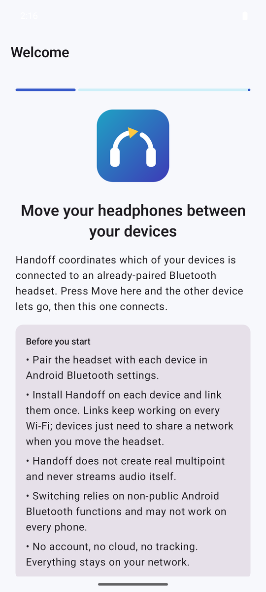</td>
    <td align="center">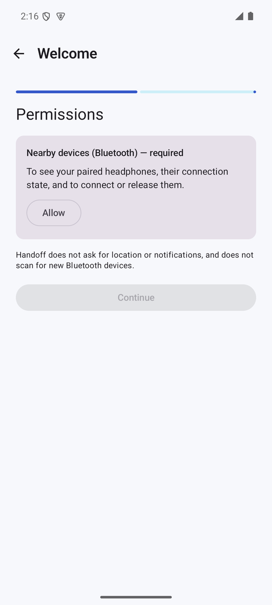</td>
    <td align="center">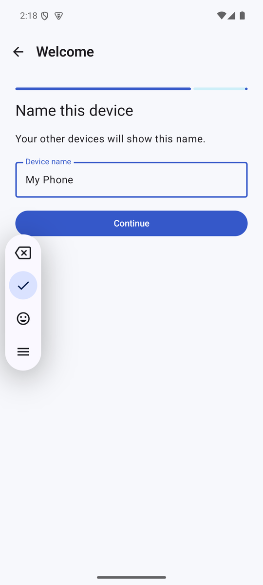</td>
    <td align="center">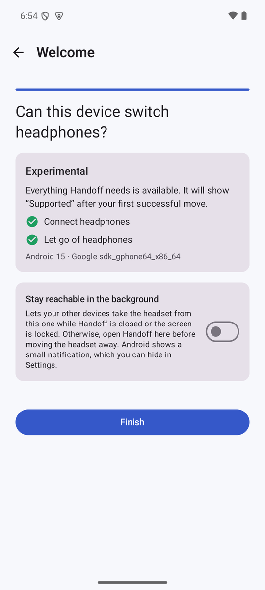</td>
  </tr>
  <tr>
    <td align="center">Welcome</td>
    <td align="center">Allow <b>Nearby devices</b></td>
    <td align="center">Name this device</td>
    <td align="center">The device check</td>
  </tr>
</table>

1. Read the welcome screen and tap **Continue**.
2. Tap **Allow**, then allow **Nearby devices** when Android asks. Handoff needs this to see and connect your headphones, and it's the only permission setup asks for. Despite the wording of Android's prompt, Handoff doesn't use your location.
3. Give your phone or tablet a name, so your other devices can show it.
4. Handoff checks whether your device can switch headphones:
   - **Supported:** Handoff has already moved headphones on this device.
   - **Experimental:** everything Handoff needs is available. It changes to Supported after your first successful move.
   - **Not supported on this device:** your phone maker doesn't let apps connect headphones. Your other devices can still take the headphones from it.
5. Choose whether Handoff should **stay reachable in the background**. Switched on, your other devices can take the headphones from this one even when Handoff is closed or the screen is locked. Switched off, open Handoff on this device before moving the headphones away from it. You can change this later in Settings; see [Running in the background](#running-in-the-background-android).

**On Windows**, there's nothing to set up. Your PC appears under its own name, which you can change in **Settings**.

## 4. Link your devices

You link each pair of devices once. After that they recognise each other on any network.

<table>
  <tr>
    <td align="center">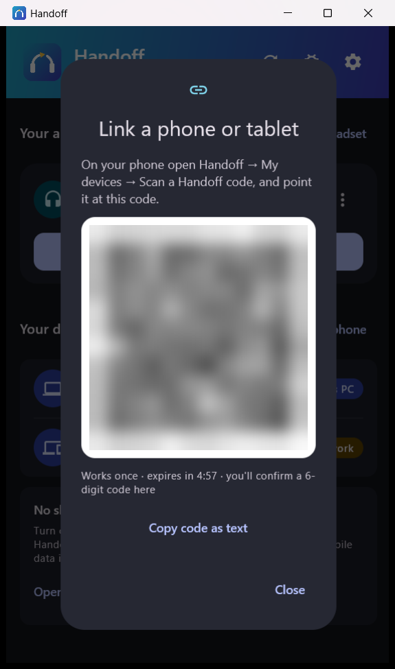</td>
    <td align="center">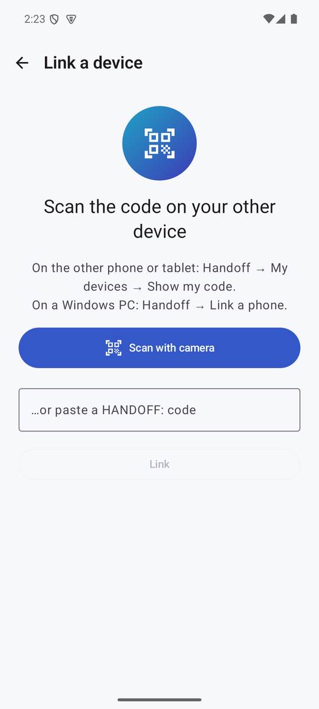</td>
    <td align="center"></td>
  </tr>
  <tr>
    <td align="center">1. The PC shows a code</td>
    <td align="center">2. The phone scans it</td>
    <td align="center">3. Check the number and tap <b>Link</b></td>
  </tr>
</table>

1. On your PC, choose **Link a phone**. A code appears.
2. On your phone, open **My devices** (**Link a device** or **Manage** on the home screen), choose **Scan a Handoff code** and point the camera at the code. No camera handy? Choose **Copy code as text** on the PC and paste the code on the phone.
3. Both screens now show the same 6-digit number. If they match, tap **Link**.

To link two Android devices, choose **Show my code instead** on one and **Scan a Handoff code** on the other.

A code works only once and expires after five minutes. Only link devices that you own and have in front of you: a linked device can move your headphones.

## 5. Add your headphones

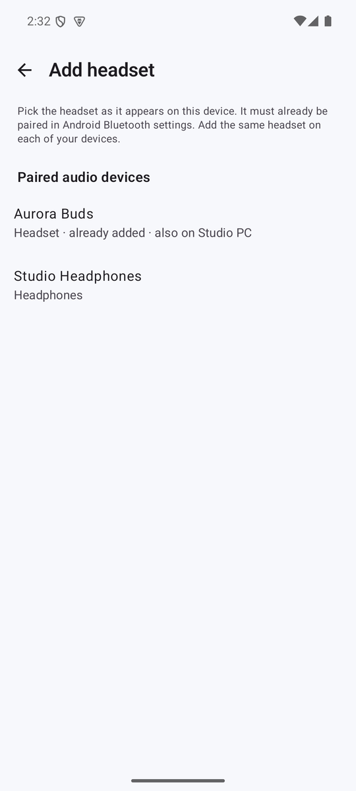

On each device, tap **Add headset** and choose your headphones from the list. It shows the headphones already paired with that device.

If another of your devices already has those headphones in Handoff, the list says so ("also on Studio PC") and Handoff treats them as the same pair everywhere.

Add the same headphones on every device you want to use them with.

 

## Moving your headphones

Tap **Move here** on the device you want to listen on.

<table>
  <tr>
    <td align="center"></td>
    <td align="center"></td>
    <td align="center"></td>
    <td align="center">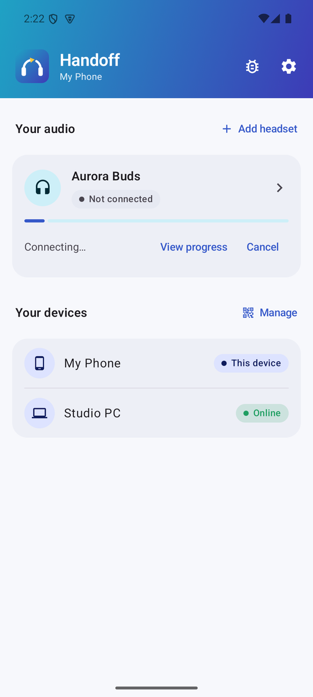</td>
  </tr>
  <tr>
    <td align="center">Tap <b>Move here</b></td>
    <td align="center">The other device lets go</td>
    <td align="center">Connected and checked</td>
    <td align="center">Follow or cancel from home</td>
  </tr>
</table>

You'll see each step as it happens:

1. The device that has your headphones is asked to let go.
2. It disconnects them.
3. Your device connects and checks that sound really comes through.

It usually takes a few seconds. You can leave the screen while it's running: the home screen shows the progress, with **View progress** to see the details again and **Cancel** to stop.

You can also move your headphones from:
- **Android:** the **Move here** tile in Quick Settings. Swipe down twice, tap the pencil (edit) icon and drag the tile into place. If you've added more than one pair of headphones, choose which pair the tile moves in the headphones' details (**Use for the Quick Settings tile**).
- **Windows:** the tray icon's menu (**Move … here**).

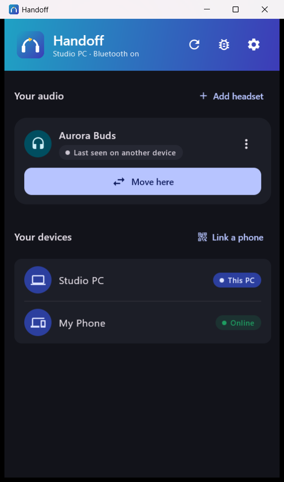

**On Windows**, the Handoff window shows where your headphones are, their battery level and your linked devices. Closing the window keeps Handoff running in the tray, so your phone can still reach the PC. To quit, choose **Quit Handoff** in the tray menu. Opening Handoff again brings the same window back.

 

## Wi-Fi, travel and hotspots

Links belong to your devices, not to a network, so they keep working wherever you are. To move your headphones, your devices just need to be on the same network at that moment. They find each other again by themselves after you change networks or restart.

**No Wi-Fi, or a network that blocks devices from seeing each other** (common in hotels, offices and campuses)? Turn on the hotspot on one device and connect the other to it. Handoff works over it without using mobile data. When Handoff can't find your other devices, it shows a shortcut to the hotspot settings.

## Running in the background (Android)

By default, Handoff on Android runs while the app is open and never leaves a notification behind. Your other devices can take the headphones from your phone while Handoff is open on it.

To let them take the headphones even while your phone is locked, turn on **Settings → Stay reachable in the background**. Android requires a small permanent notification for this; **Hide the notification** lets you turn it off. **Start after reboot** brings background mode back after the phone restarts.

Some phone makers close background apps to save battery. If your locked phone doesn't respond, set Handoff's battery usage to **Unrestricted**. **Settings → Battery optimization** in Handoff takes you there.

 

## Automatic switching (Android, optional)

Handoff can react when you start playing something on your phone while your headphones are on another device. In **Settings → Automatic switching**, choose **Ask with a notification** or **Move automatically**. This needs **Stay reachable in the background**, and it moves the headphones chosen for the Quick Settings tile.

## Keeping Handoff up to date

<table>
  <tr>
    <td align="center">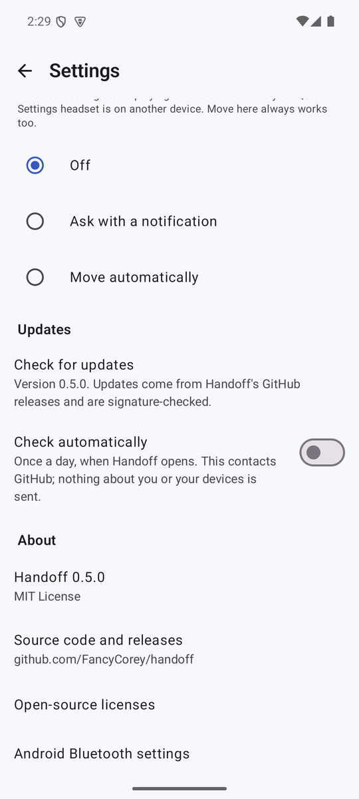</td>
    <td align="center">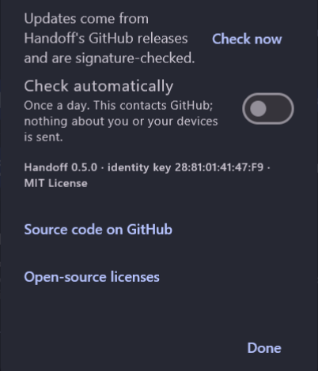</td>
  </tr>
  <tr>
    <td align="center">Android</td>
    <td align="center">Windows</td>
  </tr>
</table>

In **Settings**, **Check for updates** (Android) or **Check now** (Windows) looks for a new version. Turn on **Check automatically** to have Handoff look once a day. When an update is available, a banner appears on the home screen. **Download and install** fetches it and checks that it really comes from this project before installing it. Android and Windows then ask you to confirm the installation.

If you use the portable Windows version, Handoff opens the release page instead, so you can download the new zip.

Checking for updates is the only time Handoff uses the internet, and it sends nothing about you or your devices.

## Managing your devices and headphones

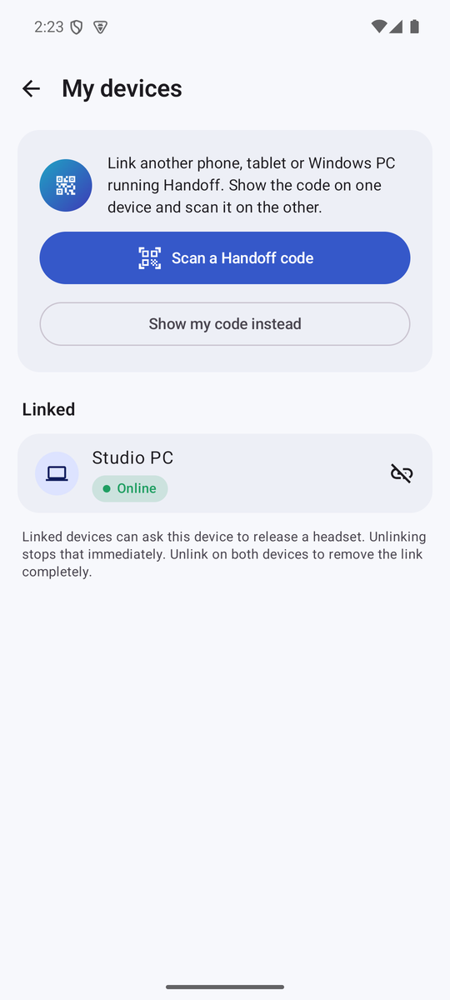

- **Linked devices:** on Android, **My devices** lists them and shows whether each is online. Tap the unlink icon to remove one. Unlink on both devices to remove the link completely.
- **Names:** on Android, **Settings → Device name**. On Windows, **Settings → This PC's name**.
- **Headphone options:** tap your headphones on Android, or their **⋮** button on Windows:
  - **Multipoint headset:** switch this on for headphones that can connect to two devices at once. **Move here** then adds this device instead of disconnecting the other.
  - **Use for the Quick Settings tile** (Android) or **Tray headset** (Windows): the headphones the tile or tray menu moves.
  - **Forget:** removes the headphones from Handoff on that device. Their Bluetooth pairing isn't changed.
- **Start with Windows:** on or off in the Windows **Settings**.

 

## If something goes wrong

If a move doesn't work, Handoff tries once more by itself. If it still can't finish, it tells you why:

| Handoff says | What to do |
|---|---|
| **Couldn't reach …** or **On another network** | Open Handoff on the other device, or turn on **Stay reachable in the background** there. Make sure both devices are on the same Wi-Fi. No shared Wi-Fi? Use a hotspot. |
| **The other device couldn't let go** | Disconnect the headphones on that device yourself, then tap **Move here** again. |
| **… doesn't recognise this device** | The link only exists on one of the two devices. In **My devices**, unlink the other device and link them again. If an older copy of Handoff is installed on either device, uninstall it first. |
| **The headset didn't connect** | Check that your headphones are on, charged and close by, and not connected to a device without Handoff. |
| **Another device is taking it** | Two devices asked for the headphones at the same moment. Wait a second and try again. |
| **Bluetooth permission needed** | Tap **Open app settings** and allow **Nearby devices**. |
| **Bluetooth is off** | Turn Bluetooth on and try again. |
| **Not paired with this device** | Pair the headphones in this device's Bluetooth settings first. |
| **Too many attempts** | Handoff pauses briefly to protect your Bluetooth. Wait a minute. |

**On Windows**, after your headphones move to another device, they no longer appear in the PC's sound settings. That's on purpose: it stops Windows from pulling them back. Tap **Move here** on the PC to get them back, or choose **Restore Windows audio** in the headphones' options.

**Two copies of Handoff on one device?** If you installed a test version of Handoff earlier, it can still be on your device next to the current one, and your other devices may link to the wrong copy. Handoff shows a warning on its home screen when it finds one; tap **Uninstall the older copy**, then link your devices again.

**Windows won't start Handoff?** If your PC has *Smart App Control* switched on, Windows blocks apps that aren't code-signed yet and offers no "Run anyway" option. Code signing is planned.

**Still stuck?** **Diagnostics** (the bug icon in the app) shows what Handoff sees on your device. You can share a report (the share button on Android, **Copy & close** on Windows) when you [open an issue](https://github.com/FancyCorey/handoff/issues). Reports hide most of your headphones' Bluetooth address and never include your keys.

## What Handoff is allowed to do on Android

| Permission | Why Handoff needs it |
|---|---|
| Nearby devices | See your paired headphones, and connect or disconnect them. |
| Network access | Talk to your other devices on your network, and check for updates when you ask. |
| Install apps | Install an update you've downloaded. Android asks you to confirm each time. |
| Run in the background | Only if you turn on **Stay reachable in the background**. |
| Notifications | Only if you turn on background mode or **Ask with a notification**. |
| Start at boot | Only to restart background mode after a reboot, if it's on. |
| Camera | Only when you scan a link code. You can paste the code instead. |

Handoff never asks for your location and never searches for new Bluetooth devices.

## Uninstalling

- **Android:** uninstall Handoff like any other app. Its data and keys are removed with it.
- **Windows:** first, if your headphones were last handed to another device, choose **Restore Windows audio** in their options so Windows can use them again. Then go to **Settings → Apps → Installed apps → Handoff → Uninstall**. Your settings and links stay in `%APPDATA%\Handoff` in case you reinstall; delete that folder to remove them too.
