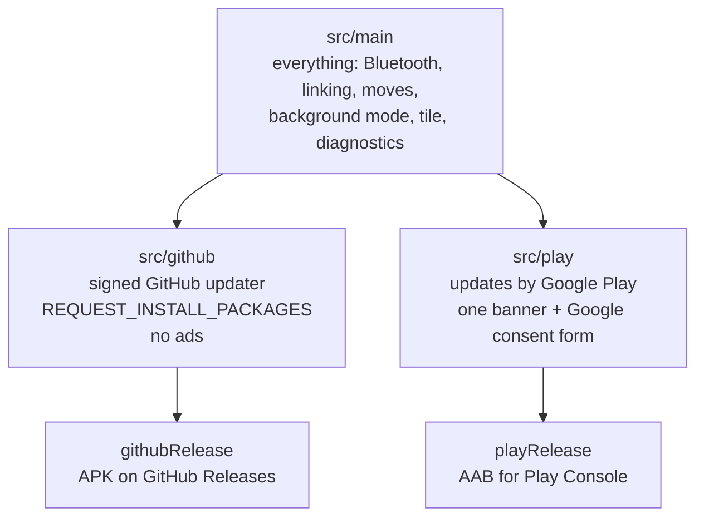
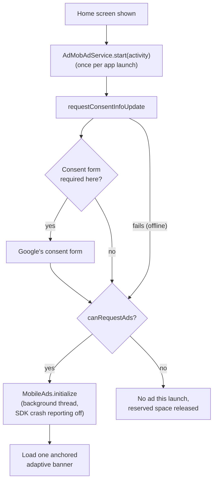
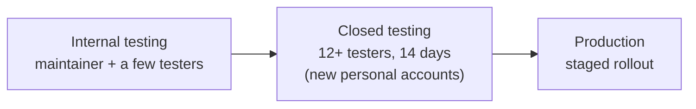

# Google Play edition

This is the maintainer's reference for publishing Handoff on Google Play: how the Play edition differs from the GitHub edition, how it is configured and built, and what to enter in Play Console. It describes the app as implemented in this repository. Re-check the Data safety and advertising sections whenever the ad setup or a Google SDK version changes.

## Two editions, one app



Both editions are built from the same code and have the same features. Only three things differ, and they live in the flavor source sets (`app/src/github`, `app/src/play`):

| | GitHub edition | Google Play edition |
|---|---|---|
| Updates | Checks Handoff's signed GitHub releases, downloads and verifies the APK, hands it to Android's installer (`AppUpdates`) | Managed by Google Play. Settings says so and opens the store listing (`PlayStoreUpdates`). No download or installer code is reachable. |
| `REQUEST_INSTALL_PACKAGES`, update `FileProvider` | Yes | No (removed with `tools:node="remove"` as a safeguard) |
| Advertising | None. No ad SDK, no advertising ID permission (`NoOpAdService`) | One banner at the bottom of the home screen (`AdMobAdService`, `HomeAdSlot`) |
| Package | `dev.handoff.app` | `dev.handoff.app` |
| Output | `Handoff-<version>-github-release.apk` | `Handoff-<version>-play-release.aab` |

The build enforces the split. `./gradlew :app:verifyEditions` (also run before every assemble and bundle) fails if the Play manifest contains `REQUEST_INSTALL_PACKAGES` or the update provider, or if the GitHub edition depends on any `com.google.android.gms`, `com.google.android.libraries.ads` or `com.google.android.ump` library, or its manifest contains the advertising ID permission.

**Package name.** Both editions use `dev.handoff.app`, so a device has one or the other. Decide before the first production upload whether that is final. A Play app's package name can never change.

## Building

```bash
./gradlew :app:lintPlayRelease          # lint the Play release build
./gradlew :app:bundlePlayRelease        # app/build/outputs/bundle/playRelease/Handoff-<version>-play-release.aab
./gradlew :app:assemblePlayDebug        # installable Play-edition debug APK (test ads only)
```

`tools\release.ps1 -PlayBundle` builds the signed bundle into `build\release\play-v<version>\` next to the GitHub release files. It is never uploaded to GitHub.

**Signing.** Use [Play App Signing](https://support.google.com/googleplay/android-developer/answer/9842756): Google holds the app signing key, and you sign uploads with an upload key.

- The Play build is signed with `%USERPROFILE%\.handoff-release\play-signing.properties` if it exists (or `-Phandoff.playSigning=<file>`), otherwise with the GitHub release key in `signing.properties`, otherwise not at all. CI has neither, so it produces an unsigned bundle, which is enough to check that it builds.
- `play-signing.properties` has the same four keys as `signing.properties` (`storeFile`, `storePassword`, `keyAlias`, `keyPassword`). Create an upload key with `keytool -genkeypair -keystore handoff-upload.jks -storetype PKCS12 -alias upload -keyalg RSA -keysize 4096 -validity 36500 -dname "CN=Handoff"`.
- Optional: when enrolling, Play lets you upload your own app signing key instead of letting Google create one. Using the GitHub release key there makes Play and GitHub APKs share a signature, so users can switch editions without uninstalling. This means giving Google a copy of that key. Decide before the first upload, because it can't be changed afterwards.
- Never commit keystores, `*.properties` with passwords, the update-signing key or Play credentials. `.gitignore` excludes `*.jks`, `*.keystore`, `*.pk8`, the signing properties files and service-account JSON files.

**Versions.** `versionCode` must increase with every upload to Play (and every GitHub release). Both editions share `versionCode` and `versionName` from `app/build.gradle.kts`.

**Code shrinking (R8)** stays off for now, in both editions. Turn it on only after checking Compose, the reflective Bluetooth calls, Room, Koin, QR scanning, serialization and the peer protocol on real devices, and add keep rules for what breaks.

## AdMob

The Play edition uses the [Google Mobile Ads SDK (next-gen)](https://developers.google.com/admob/android/next-gen/quick-start) `com.google.android.libraries.ads.mobile.sdk:ads-mobile-sdk` and the [User Messaging Platform](https://developers.google.com/admob/android/privacy) `com.google.android.ump:user-messaging-platform`. Versions are in `gradle/libs.versions.toml`.

**IDs.** Without configuration, every build uses Google's published test IDs, which only ever show test ads:

| Property | Test value (default) | Where it ends up |
|---|---|---|
| `handoff.admobAppId` | `ca-app-pub-3940256099942544~3347511713` | Manifest `com.google.android.gms.ads.APPLICATION_ID` (the consent SDK reads it there), `BuildConfig.ADMOB_APP_ID` (SDK initialization) |
| `handoff.admobBannerId` | `ca-app-pub-3940256099942544/9214589741` | `BuildConfig.ADMOB_BANNER_ID` |

For a production build, put the real IDs from the AdMob console in `%USERPROFILE%\.gradle\gradle.properties` (outside the repository), or pass them with `-P`:

```properties
handoff.admobAppId=ca-app-pub-XXXXXXXXXXXXXXXX~YYYYYYYYYY
handoff.admobBannerId=ca-app-pub-XXXXXXXXXXXXXXXX/ZZZZZZZZZZ
```

Debug builds always request Google's test banner, whatever the properties say, so development never shows or clicks live ads. Before uploading, check that a release build's merged manifest carries the real app ID.

**What the code does** (`app/src/play/.../ads/`):



- Nothing ad-related starts before the home screen appears, so setup, linking and background mode never wait for it. Bluetooth, moves, linking, the tile and background mode don't depend on it in any way.
- The banner sits below the home screen list, never over it. Its height is reserved from the start (Google's anchored adaptive size is known before loading), a divider and a "Sponsored" label separate it from the headset cards, and the list keeps 24 dp of padding below the last card, so a late-loading ad never moves a **Move here** button under the user's finger.
- The ad request carries only the ad unit and size: no keywords, content URL, extras or custom targeting.
- If ads can't be requested (no consent, offline, SDK error) or Google has no ad to show (no fill), the slot closes and the home screen simply has no ad. The slot is below the list, so closing it moves nothing.
- Not used, by design: interstitials, rewarded ads, app-open ads, native ads in the list, ads on any other screen, ads in notifications or the tile.
- **Remove ads (future).** `AdMobAdService` takes an `adsRemoved: StateFlow<Boolean>`. A one-time Play Billing purchase would feed it; when true, no space is reserved and no ad is requested. No feature may ever depend on it.

**Testing consent.** Google's form only appears where regulations require it. To see it from elsewhere, temporarily add `ConsentDebugSettings` with `DEBUG_GEOGRAPHY_EEA` and your test device hash (Logcat prints it, tag `UserMessagingPlatform`) to the `ConsentRequestParameters` in `AdMobAdService`, and remove it again before committing. The **Ad privacy choices** entry in Settings appears only when UMP reports that privacy options are required.

**In the AdMob console:** create the app and one banner ad unit, publish a GDPR message (and a US state regulations message if relevant) under **Privacy & messaging**, and add the site where `app-ads.txt` will be served once the store listing has a developer website.

## Data safety

Play Console → **App content** → **Data safety**. Answers based on the Play edition as implemented. The only data collected or shared is by Google's Mobile Ads SDK. Handoff itself sends nothing to the developer or any server.

**Does your app collect or share any of the required user data types?** Yes (because of the ad SDK).

**Is all user data encrypted in transit?** Yes. The ad SDK uses TLS, and Handoff's own device-to-device traffic is encrypted (and never leaves the local network).

**Do you provide a way for users to request that their data is deleted?** Handoff holds no user data off the device; the ad SDK's data is handled by Google (advertising ID reset and deletion in Android settings). Answer according to Play's current wording for SDK-only collection.

| Data type (Play category) | Collected | Shared | Optional? | Purposes | Source |
|---|---|---|---|---|---|
| Location → Approximate location (derived from IP address) | Yes | Yes | No | Advertising or marketing, Analytics, Fraud prevention, security and compliance | Google Mobile Ads SDK |
| App activity → App interactions | Yes | Yes | No | Advertising or marketing, Analytics, Fraud prevention, security and compliance | Google Mobile Ads SDK |
| App info and performance → Diagnostics | Yes | Yes | No | Analytics, Fraud prevention, security and compliance | Google Mobile Ads SDK |
| Device or other IDs (advertising ID, app set ID) | Yes | Yes | Advertising ID can be reset or deleted by the user | Advertising or marketing, Analytics, Fraud prevention, security and compliance | Google Mobile Ads SDK |

Check these rows against [Google's current disclosure for the next-gen SDK](https://developers.google.com/admob/android/next-gen/privacy/play-data-disclosure) before each submission; Google, not this file, is the source of truth for its SDK. Crash logs: the SDK's crash reporting is disabled (`disableSdkCrashReporting()`), so don't declare crash logs unless Google's disclosure says they are still collected.

**Not collected** (stays on the device, or goes only to the user's own linked devices, encrypted, on the local network): device names, headset names, Bluetooth addresses, identity keys, linked-device records, network addresses, move history, diagnostics, camera images. Play's definition of "collected" covers data sent off the device to the developer or third parties; device-to-device traffic the user sets up doesn't go to either.

**GitHub edition** (not on Play): contains no advertising or analytics code. Its only network traffic besides linked devices is the optional GitHub update check.

## Other App content declarations

| Declaration | Answer |
|---|---|
| Privacy policy | The public URL of [PRIVACY.md](../PRIVACY.md) (see below) |
| Ads | Yes, the app contains ads |
| Advertising ID | Yes, used for advertising and analytics by the ad SDK. The Play edition's manifest contains `com.google.android.gms.permission.AD_ID` (merged from the SDK). |
| App access | All features are available without an account or login |
| Content rating | Utility, no user-generated content, no user communication. Answer the questionnaire accordingly; the ad content is covered by the AdMob ad content settings (consider limiting ad content to G/PG in AdMob). |
| Target audience | 18+ or 13+ as you prefer; not designed for children. If children are included, Families policies apply to the ads. |
| Foreground service | See below |
| Government app / financial features / health | No |

**Other permissions merged from the ad SDK** (Play edition only): `READ_BASIC_PHONE_STATE` and `WAKE_LOCK` (normal permissions, no prompt) and `AD_ID`. `INTERNET` and `ACCESS_NETWORK_STATE` are already used by Handoff for the local network.

## Foreground service declaration

Play Console → **App content** → **Foreground service permissions**. Handoff declares one type:

- **Type:** `connectedDevice` (`FOREGROUND_SERVICE_CONNECTED_DEVICE`, service `HandoffService`).
- **Use case:** interacting with a Bluetooth audio device (headset) on the user's behalf.
- **Description:**
  > When the user turns on "Stay reachable in the background", Handoff runs a user-visible connected-device foreground service so that another of the user's own linked devices (phone, tablet or PC) can ask this device to release the user's Bluetooth headset while this phone or tablet is locked or Handoff isn't open. The service is off by default, is only started after the user switches it on, shows a persistent notification while it runs, and stops as soon as the user turns the setting off.
- **Impact if deferred or stopped:** the user's other device can't take the headset. The headset stays connected to this device, and the user has to unlock it and disconnect the headset by hand.
- **Video:** record on a real device: turn on the setting (show the notification appear), lock the device, tap **Move here** on a second device, show the headset moving over, then turn the setting off and show the notification disappearing. Upload it as unlisted and paste the link.

These properties are already implemented: off by default and offered during setup, started only when enabled (`MainActivity`, `BootReceiver` only if **Start after reboot** is also on), a notification while running, and one switch in Settings to stop it.

## Privacy policy URL

Play needs a public, non-editable-by-others HTTPS page. Options:

1. `https://github.com/FancyCorey/handoff/blob/main/PRIVACY.md`, the in-app default. It works today, but it's a GitHub page rather than a plain policy page.
2. A GitHub Pages copy (for example `https://fancycorey.github.io/handoff/privacy`). Recommended for the store listing.

The app opens `BuildConfig.PRIVACY_POLICY_URL`, set from `-Phandoff.privacyUrl=<url>` (or `handoff.privacyUrl` in `gradle.properties`), with option 1 as the default. When a final URL exists, set it there and in Play Console to the same address.

## Store listing

**Name (30 characters max):** `Handoff: Headphone Switcher`. The part after the colon says what the app does in the words people search for, and sets the listing apart from Apple's Handoff feature (see [Name risk](#name-risk)). The launcher label stays "Handoff".

**Short description (80 characters max), suggested:**
> Move your Bluetooth headphones between your phone, tablet and PC with one tap.

**Full description, outline:**

1. One line: move your Bluetooth headphones between your devices with one tap.
2. The problem: sound stays on the laptop when you pick up your phone.
3. How it works: link your devices once, press **Move here**; the other device lets go and this one connects. Audio still goes straight from the device to the headphones.
4. Features: Quick Settings tile, battery level, works on any shared Wi-Fi or a hotspot, cancel a move, optional background mode, Windows companion app (download from GitHub).
5. Privacy: no account, no Handoff servers; devices talk only to each other, encrypted, on the local network. This edition shows one small ad from Google AdMob; the free GitHub edition has none.
6. Compatibility, honestly: works on supported Android devices running Android 12 or newer. Android has no official way for apps to connect Bluetooth headphones, so Handoff uses methods some manufacturers restrict; the app tells you on first launch whether your device supports it. Compatibility depends on Android version and manufacturer.
7. Open source (MIT) with a link to the repository.

Don't claim: works on every Android device, universal Bluetooth control, turns any headset into multipoint, guaranteed or instant switching, Apple compatibility.

**Support URL / website:** `https://github.com/FancyCorey/handoff` (issues for support).

## Store assets checklist

| Asset | Requirement | Status / source |
|---|---|---|
| App icon | 512×512 PNG, 32-bit, ≤ 1 MB, full square | `docs/brand/handoff-play-icon-512.png` (see [BRANDING.md](BRANDING.md)) |
| Feature graphic | 1024×500 PNG or JPEG | To do |
| Phone screenshots | 2–8, 16:9 or 9:16, 320–3840 px sides | Take from demo mode (see CONTRIBUTING.md). Current ones are in `docs/screenshots/`. Use the Play edition so the banner is shown truthfully. |
| Tablet screenshots (7" and 10") | Needed to be featured for tablets | To do, demo mode on a tablet emulator |
| Short description | ≤ 80 characters | Suggested above |
| Full description | ≤ 4000 characters | Outline above |
| Privacy policy URL | Public HTTPS | See above |
| Support URL | | GitHub repository |
| Source code URL | In the description | `https://github.com/FancyCorey/handoff` |
| Foreground service declaration and video | | Text above, video to record |
| Data safety | | Table above |
| Content rating questionnaire | | Answer in Play Console |
| Ads and Advertising ID declarations | | Above |
| Contact email | Required for the developer account | Maintainer's choice |

All screenshots must use demo data (no real device names, headset names or addresses).

## Testing tracks



1. **Internal testing** first. Check on real devices: install from Play, Bluetooth and notification permissions, setup (including the background-mode choice), linking by QR code, moves in both directions, background release while locked, the Quick Settings tile, the banner position and that it never covers anything, Settings → Privacy, that Settings shows "Updates are managed by Google Play" and there is no install prompt anywhere, and a Play update from one internal build to the next.
2. Read the **pre-launch report** (crashes, accessibility, warnings about non-SDK interfaces).
3. **Closed testing.** Personal developer accounts created after 13 November 2023 need a closed test with at least 12 testers opted in for 14 days in a row before applying for production access. Use it to collect device and headset reports (see [HARDWARE_TEST_PLAN.md](HARDWARE_TEST_PLAN.md)).
4. **Production** with a staged rollout.

**Target API.** Since 31 August 2026, new apps and updates must target API 36. Handoff targets 36.

## Name risk

Apple uses **Handoff** as the name of a Continuity feature on its devices. This project's name overlaps with it, in a related area (moving something between your devices). That doesn't necessarily prevent using the name, but it is a risk to review before a Play launch or any marketing push. (This is not legal advice.)

Until the owner decides:

- Never describe Handoff as affiliated with, endorsed by, compatible with or a replacement for Apple Handoff or Apple Continuity. It doesn't work with Apple devices.
- Avoid Apple's visual language in icons and screenshots.
- The store name is "Handoff: Headphone Switcher" rather than "Handoff" alone. A fully distinctive name would be stronger if the project ever wants a registered trademark. Renaming the app on Play is possible later, but the package name `dev.handoff.app` is permanent once published.

The decision is the project owner's.

## Before each Play submission

- [ ] `versionCode` increased; release notes written.
- [ ] `./gradlew :app:verifyEditions :app:lintPlayRelease :app:bundlePlayRelease` pass.
- [ ] Merged release manifest has the real AdMob app ID; the real banner ID is set.
- [ ] Bundle is signed with the upload key.
- [ ] Data safety still matches Google's current SDK disclosure and the code.
- [ ] Hardware checks for this version done ([HARDWARE_TEST_PLAN.md](HARDWARE_TEST_PLAN.md)), including Android 16.
- [ ] Internal test install checked; pre-launch report read.
