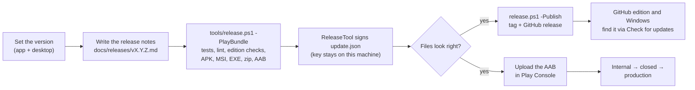

# Release process

Handoff ships three things from one version number:

| What | Built by | Published on |
|---|---|---|
| Android, GitHub edition (`githubRelease` APK) | `tools/release.ps1` | GitHub Releases, installed and updated by the app's own signed updater |
| Windows (MSI, setup EXE, portable zip) | `tools/release.ps1` | GitHub Releases, same updater |
| Android, Google Play edition (`playRelease` AAB) | `tools/release.ps1 -PlayBundle` or `./gradlew :app:bundlePlayRelease` | Play Console, updated by Google Play |

Everything is built and signed on the maintainer's machine. No key is ever stored in the repository or on GitHub.

## Keys

They live in `%USERPROFILE%\.handoff-release\` and must be backed up somewhere safe and private:

| File | Purpose | If lost |
|---|---|---|
| `handoff-release.jks` + `signing.properties` | Signs the GitHub edition APK. Android only installs an update over an app signed with the same key. | Existing GitHub-edition installs can't update in place; users must uninstall and reinstall. |
| `update-signing.pk8` | Signs `update.json`, which the GitHub edition and Windows app check before offering or installing an update. Its public half is `UpdateKeys` in `:core`. | Apps can't verify new releases until they are updated to a new public key by hand. |
| Upload keystore + `play-signing.properties` (optional) | Signs the bundle uploaded to Play Console. Without it, the Play bundle is signed with the GitHub release key. | Ask Google Play support to reset the upload key; the app signing key held by Google is unaffected. |

To create them on a new machine (only for a brand-new project; otherwise restore the backup): `keytool -genkeypair -keystore handoff-release.jks -storetype PKCS12 -alias handoff -keyalg RSA -keysize 4096 -validity 36500 -dname "CN=Handoff"`, write `signing.properties` (`storeFile`, `storePassword`, `keyAlias`, `keyPassword`), and run `./gradlew :core:releaseTool -PtoolArgs="keygen,<dir>"` for the update key. The Play upload key is described in [PLAY_STORE.md](PLAY_STORE.md#building).

AdMob production IDs aren't secrets, but they stay out of the repository too (`%USERPROFILE%\.gradle\gradle.properties`, see [PLAY_STORE.md](PLAY_STORE.md#admob)).

## Versions

- `versionName` in `app/build.gradle.kts` and `appVersion` in `desktop/build.gradle.kts` must match; `release.ps1` refuses to run otherwise.
- `versionCode` in `app/build.gradle.kts` must go up by at least one for every release. Google Play rejects a bundle whose `versionCode` was already uploaded, even to a test track.
- Both Android editions share the same version.

## Cutting a release

1. Set the version (see above).
2. Write the notes in `docs/releases/v<version>.md`: what changed for people using the app, in plain words. They appear on the release page and, as plain text, in the apps' update screen.
3. `powershell -ExecutionPolicy Bypass -File tools\release.ps1 -PlayBundle` runs the tests, lint and edition checks, then builds and signs:
   - `build/release/v<version>/`: the GitHub edition APK, the MSI and setup EXE, a portable zip, `update.json`, `update.json.sig` and `SHA256SUMS.txt`;
   - `build/release/play-v<version>/Handoff-<version>-play.aab`.
4. Check the files, then run it again with `-Publish` to tag the version and create the GitHub release (`HANDOFF_GH` can point to a `gh` executable that isn't on the PATH). Only the files in `v<version>` are uploaded; the Play bundle never is.
5. Upload the bundle in Play Console, following [PLAY_STORE.md](PLAY_STORE.md#testing-tracks): internal testing first, then closed testing, then production with a staged rollout. Go through the [submission checklist](PLAY_STORE.md#before-each-play-submission) each time.

The Windows files are not code-signed yet, so SmartScreen shows "Windows protected your PC" for new downloads and Smart App Control blocks them. Code signing (for example through the SignPath Foundation's free program for open-source projects) removes both.

## CI

`.github/workflows/ci.yml` runs on every push and pull request, with no secrets:

1. `./gradlew test`: all unit tests.
2. Lint for `:bluetooth`, the GitHub and Play debug builds, and the Play release build.
3. `:app:verifyEditions`: the Play edition can't self-install; the GitHub edition has no advertising library or advertising-ID permission.
4. `:app:assembleGithubDebug`, `:app:assemblePlayDebug`, and `:app:bundlePlayRelease` (unsigned in CI, which proves the bundle builds).
5. `:desktop:test` and `:desktop:packageMsi`.

The APKs, the bundle and the MSI are kept as build artifacts for 14 days.
