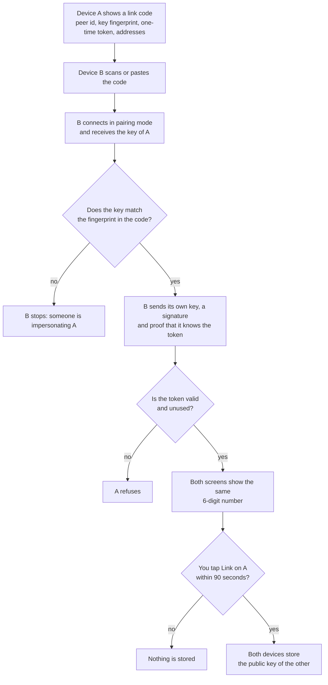
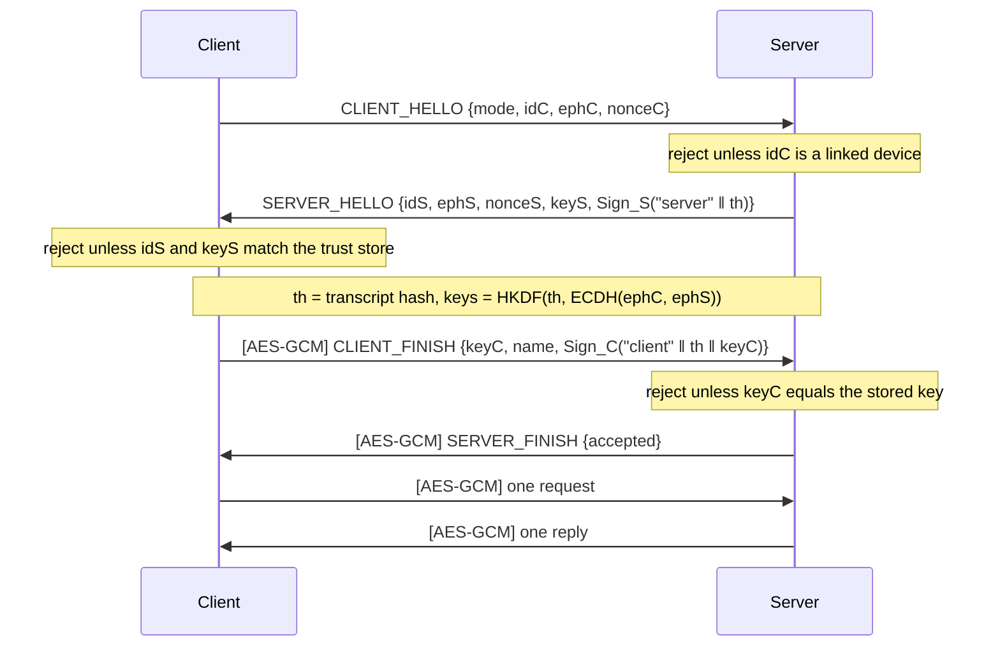

# Security

Handoff lets one device make another device disconnect its headphones. The design goal is simple: **only devices you explicitly linked can do that, and nobody on the network can forge, read or replay their commands.**

## Threat model

* The LAN is **untrusted**: others on the Wi-Fi can sniff traffic, spoof mDNS, connect to the port and replay packets.
* Your linked devices are trusted for exactly one thing: asking to release or connect headsets and reading which headsets you have added.
* Out of scope: a compromised or rooted device you linked, and physical access to an unlocked device.

## Identity and keys

* Each install generates a P-256 ECDSA identity key.
  * **Android:** the key is generated inside the **Android Keystore**. It is hardware-backed where available, non-exportable, and used only through `Signature.initSign`.
  * **Windows:** the key is generated in software. Its private part is stored only in encrypted form, protected with **DPAPI** (`CryptProtectData`, bound to the Windows user account), in `%APPDATA%\Handoff\identity.key`. It never touches disk in plaintext. Another Windows user, or a copy of the file on another PC, cannot decrypt it.
* Nothing secret is stored in Room, DataStore, SharedPreferences or the Windows JSON files (`peers.json`, `headsets.json`, `settings.json`). They hold peer ids, names and peers' *public* keys only.
* Backups and device transfer are disabled (`allowBackup=false`, `dataExtractionRules`), so trust records can't be restored onto a device whose Keystore key differs.
* If the Keystore key is ever lost, the install mints a **new** peer id. Peers see an unknown device rather than a known id with a wrong key.

## Linking (pairing)



1. Device A shows a QR code: `HANDOFF:` followed by Base32 of a ~56-byte binary payload. It contains:
   * A's peer id (UUID)
   * a **128-bit SHA-256 fingerprint of A's identity key**
   * a **single-use 128-bit token**
   * the port and LAN IPv4 addresses

   The code stays in QR alphanumeric mode (≈33×33 modules), so it scans instantly. It expires after **5 minutes**, enforced by A.
2. Device B scans it and connects in `PAIRING` mode. It accepts A's handshake key only if it matches the fingerprint in the QR code, so a man in the middle cannot impersonate A (forging a 128-bit commitment is infeasible). B then stores A's full key.
3. B proves knowledge of the token with `HMAC(token, transcript)` and proves possession of its own key by signature. The token is consumed on first valid use.
4. A shows **"Link B?"** with a 6-digit code derived from the handshake transcript, and B shows the same code. Nothing is stored until the user taps **Link** on A (90 s timeout).
5. Both sides store the other's public key.

The QR code is sensitive only while it is displayed. Someone who photographs it still needs your approval on A within the validity window.

## Session handshake (every connection)

It follows a SIGMA-style authenticated key exchange:



In detail:

```
C → S  CLIENT_HELLO  {mode, idC, ephC, nonceC}
S → C  SERVER_HELLO  {idS, ephS, nonceS, keyS, Sign_S("server" ‖ th)}
       th = SHA-256(label ‖ mode ‖ idC ‖ ephC ‖ nonceC ‖ idS ‖ ephS ‖ nonceS ‖ keyS)
       k_c2s, k_s2c = HKDF-SHA256(salt = th, ikm = ECDH(ephC, ephS))
C → S  [AES-GCM] CLIENT_FINISH {keyC, name, Sign_C("client" ‖ th ‖ keyC)}
S → C  [AES-GCM] SERVER_FINISH {accepted}
```

* The client aborts unless `idS` and `keyS` match its trust store.
* The server aborts unless `idC` is trusted and `keyC` equals the stored key. Unknown peers are rejected before any application message is read.
* Ephemeral P-256 ECDH gives forward secrecy. Keys are validated to be on P-256.

## Record layer

* AES-256-GCM with a per-direction key.
* The nonce is `direction ‖ 64-bit counter`, and the AAD includes the counter.
* The receiver requires the next counter exactly, so any replayed, reordered, dropped or modified frame kills the connection.
* Frames are length-prefixed and capped at 64 KiB.

## Application-level checks (`PeerServer.respond`)

* **Sender binding:** `senderPeerId` must equal the authenticated peer. `RELEASE_AUDIO_DEVICE.requestingPeerId` must also equal the sender.
* **Freshness:** the timestamp must be within ±5 minutes of local time, otherwise `ERROR STALE`.
* **Unique command ids:** a repeated `(peer, commandId)` gets the cached reply and is not executed again (idempotent release), or `ERROR DUPLICATE` while still in flight.
* **Correlation:** replies must carry `inReplyTo` equal to the request id and come from the pinned peer.
* **Versioning:** `protocolVersion` must be 1. Unknown message types are rejected, and unknown fields are ignored.
* Unsolicited replies are rejected. There are at most 8 concurrent connections, with 10 s idle timeouts.

## What is exposed on the network

* **mDNS:** a `_handoff._tcp` service named `handoff-<tag>`, where the tag is an HMAC of the device's public identity key and the current UTC day (`DiscoveryTags`). The TXT record carries only a format version. The name changes daily, so it can't be used to follow a device over time. Only linked devices, which know the key, can map it back to a peer; everything else is ignored, including advertisements from unlinked devices. Handoff 0.3 and earlier advertised `handoff-<peerId>`; that form is still understood, but only for already-linked peers.
* **A TCP port** (47474 by default). `ConnectionPolicy` drops connections from anything but private, link-local, unique-local (IPv6) or loopback addresses, so a forwarded or exposed port is still unreachable from the internet. It also limits new connections per address (30 per 10 s) and blocks an address for 60 s after 8 failed handshakes within a minute.
* An unauthenticated client learns only that Handoff is running. It receives `REJECT` without any device information. The one exception: while a link code is on screen, a `PAIRING` hello receives the public identity key, which is already in the code.
* The client's peer id appears in plaintext in the first handshake message, so a device on the same network that watches the traffic can see that two Handoff peers talk. Display names, headset names and addresses, battery levels and all commands are encrypted.
* There is **no** plaintext or unauthenticated command endpoint.

## Linking safety

* The approval dialog tells the user to link only devices they own and have in front of them, and names what a linked device can do: move the headphones, and see their names and battery level.
* Link codes are single-use and expire after 5 minutes, and the 6-digit comparison defeats a network attacker who swaps in their own key.

## Updates

* Handoff contacts the internet only to check for updates, and only when the user presses **Check for updates** or turns on the daily check (off by default). The request goes to GitHub and carries no identifiers beyond what any HTTPS request reveals (the IP address).
* Each release publishes `update.json` and `update.json.sig`. The signature (ECDSA P-256 over a fixed prefix plus the exact file) must verify against the release public key built into the app (`UpdateKeys`). The private key never leaves the maintainer's machine, so a compromised GitHub account or a modified download cannot produce an update the app will accept.
* The manifest may only point at this repository's release downloads, and every request, including redirects, must be HTTPS to GitHub's release hosts.
* A downloaded file is used only if its size and SHA-256 match the signed manifest; otherwise it is deleted.
* Android installs the update through the system installer, which asks the user to confirm and accepts it only if it is signed with the same release key as the installed app. Windows hands the verified MSI to Windows Installer.

## Logs and diagnostics

* The event log scrubs every Bluetooth-address-shaped string to `**:**:**:**:EE:FF`.
* Diagnostics export additionally strips pairing links and long base64 blobs.
* Keys, tokens and signatures are never logged. This is covered by `UtilitiesTest` and `DiagnosticsReportTest`.

## Networks

* Links are bound to identity keys, not to a network or an IP address. After a network change, peers are rediscovered and every connection re-authenticates against the stored key. A different device that takes over a peer's old IP address is rejected by the handshake.
* The Windows app listens on TCP 47474 on all interfaces, but only local-network addresses are served (see above). Unauthenticated connections get nothing but `REJECT`. The Windows Firewall prompt should be answered for private networks only.
* **Hotspots:** a device's own hotspot is a local network like any other. Handoff includes the hotspot interface in its link codes and discovery, and no traffic leaves the hotspot.
* Per peer, the last working address on each network (at most 8) is kept in the app's private storage (`peer-endpoints.json`; on Android in the no-backup directory) and never shared. It lets a restarted app, or a device returning to a known network, reach linked devices without waiting for discovery. Every connection to such an address still has to pass the handshake against the pinned key.
* **Android background mode** (a foreground service) is off by default. Without it, a device is only reachable while Handoff is open.

## Reporting vulnerabilities

Please report privately to the maintainers (e.g. a GitHub security advisory) rather than in a public issue.
